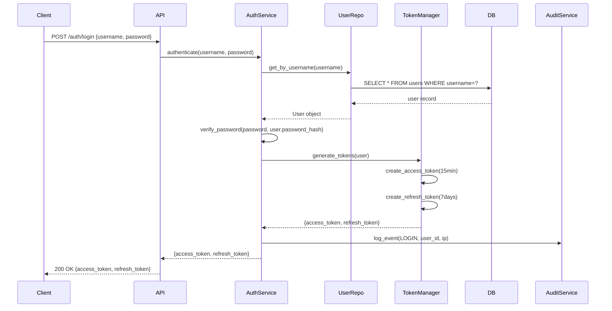
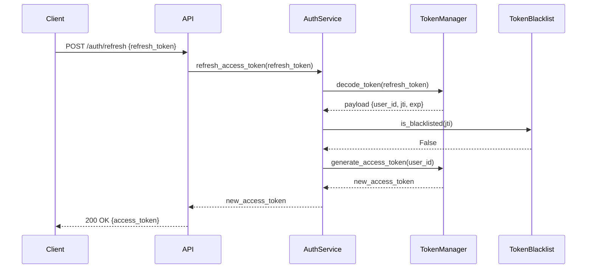
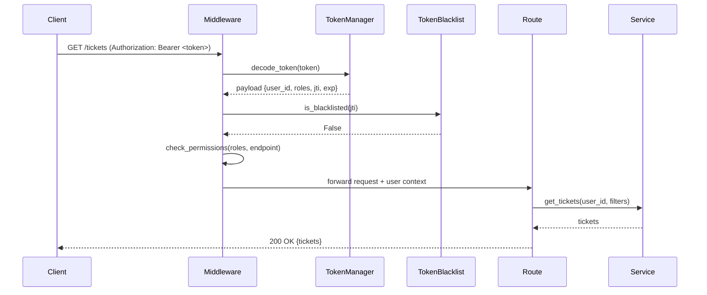
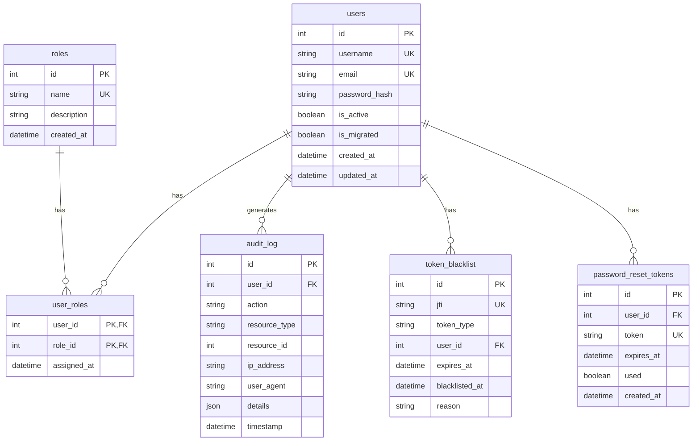
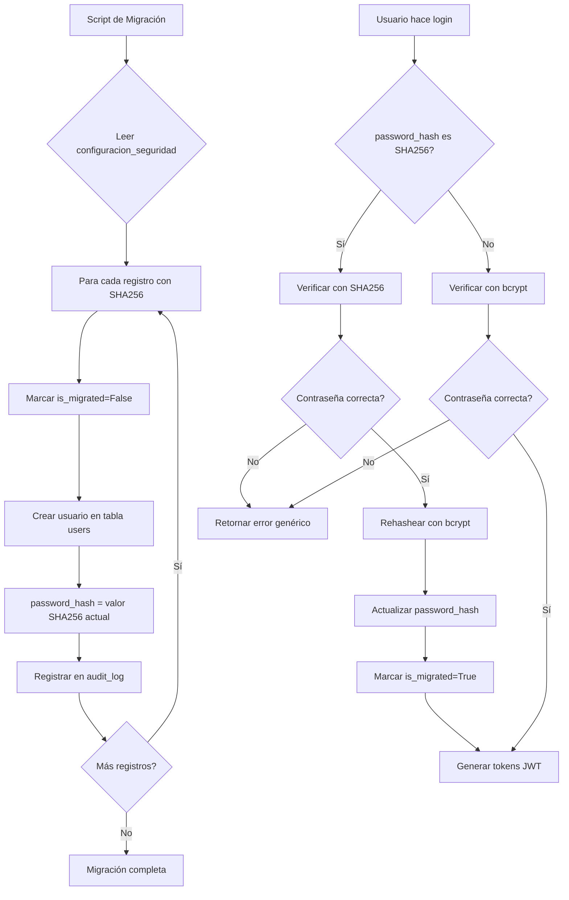
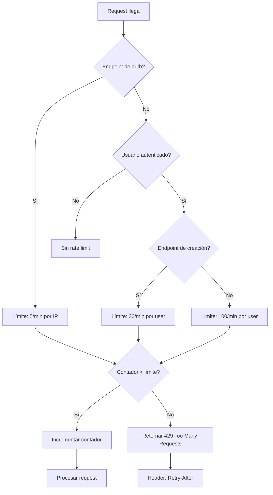
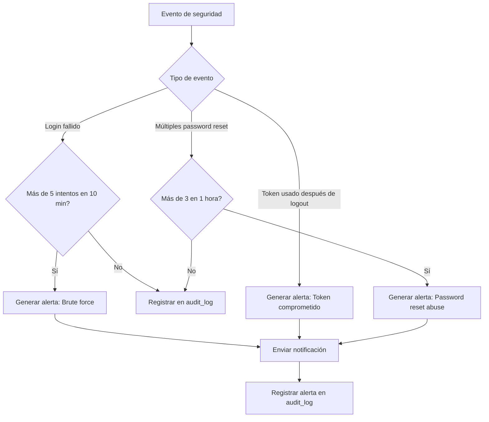
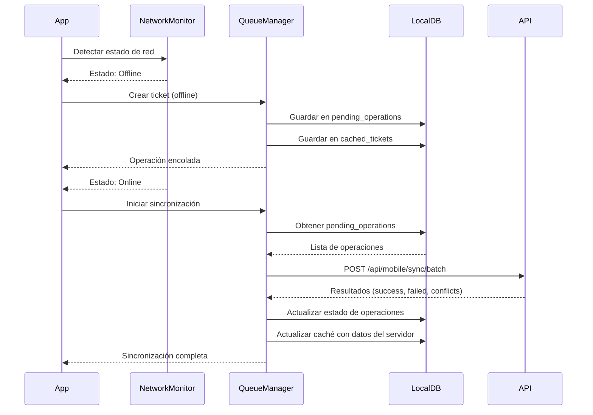

# Design Document: Mejoras de Seguridad JWT y Auditoría

## Overview

Este diseño implementa una migración completa del sistema de autenticación actual (SHA256 sin salt) a un sistema robusto basado en JWT con bcrypt/argon2, junto con mejoras arquitecturales críticas identificadas en la auditoría de seguridad.

El sistema actual presenta vulnerabilidades críticas:
- Contraseñas hasheadas con SHA256 sin salt (vulnerable a rainbow tables)
- Endpoints sensibles sin autenticación
- Información personal del desarrollador expuesta públicamente
- Lógica de negocio duplicada entre rutas
- Falta de auditoría completa de acciones

La solución implementa:
- Autenticación JWT con tokens de acceso (15 min) y refresh (7 días)
- Hashing seguro con bcrypt (cost factor 12) o argon2id
- Sistema de roles y permisos (ADMIN, MECANICO, RECEPCIONISTA, SOLO_LECTURA)
- Audit trail completo e inmutable
- Arquitectura en capas (Routes → Services → Repositories)
- Rate limiting granular por endpoint y usuario
- Migración automática de contraseñas existentes

## Architecture

### Arquitectura en Capas

```
┌─────────────────────────────────────────────────────────────┐
│                    Clientes (Mobile/Web)                     │
└──────────────────────┬──────────────────────────────────────┘
                       │ HTTP + JWT Bearer Token
┌──────────────────────▼──────────────────────────────────────┐
│                   FastAPI Application                        │
│  ┌────────────────────────────────────────────────────────┐ │
│  │              Middleware Stack                          │ │
│  │  • CORS                                                │ │
│  │  • Rate Limiting (slowapi)                             │ │
│  │  • JWT Authentication (Auth_Middleware)                │ │
│  │  • Audit Logging (Audit_Middleware)                    │ │
│  └────────────────────────────────────────────────────────┘ │
│  ┌────────────────────────────────────────────────────────┐ │
│  │                  Route Layer                           │ │
│  │  • HTTP request/response handling                      │ │
│  │  • Schema validation (Pydantic)                        │ │
│  │  • Delegation to services                              │ │
│  └────────────────────┬───────────────────────────────────┘ │
└─────────────────────────────────────────────────────────────┘
                       │
┌──────────────────────▼──────────────────────────────────────┐
│                   Service Layer                              │
│  • AuthService (login, refresh, logout, password reset)     │
│  • UserService (CRUD, role management)                       │
│  • TicketService (business logic, state transitions)        │
│  • CitaService (appointments management)                     │
│  • MovimientoCajaService (financial calculations)           │
│  • VehiculoService (vehicle management)                      │
│  • AuditService (audit trail recording)                      │
└──────────────────────┬──────────────────────────────────────┘
                       │
┌──────────────────────▼──────────────────────────────────────┐
│                 Repository Layer                             │
│  • UserRepository                                            │
│  • RoleRepository                                            │
│  • TicketRepository                                          │
│  • CitaRepository                                            │
│  • MovimientoCajaRepository                                  │
│  • VehiculoRepository                                        │
│  • AuditLogRepository                                        │
│  • TokenBlacklistRepository                                  │
└──────────────────────┬──────────────────────────────────────┘
                       │
┌──────────────────────▼──────────────────────────────────────┐
│              PostgreSQL Database                             │
│  • users, roles, user_roles                                  │
│  • audit_log (immutable)                                     │
│  • token_blacklist                                           │
│  • tickets, citas, movimientos_caja, vehiculos              │
└─────────────────────────────────────────────────────────────┘
```

### Flujo de Autenticación JWT




### Flujo de Refresh Token



### Flujo de Request Autenticado



## Components and Interfaces

### 1. Authentication Components

#### Password_Hasher
```python
class PasswordHasher:
    """Maneja hashing y verificación de contraseñas con bcrypt/argon2"""
    
    def hash_password(self, password: str) -> str:
        """
        Hashea una contraseña con bcrypt (cost factor 12) o argon2id.
        Genera un salt único y aleatorio automáticamente.
        
        Args:
            password: Contraseña en texto plano
            
        Returns:
            Hash de la contraseña (incluye salt y algoritmo)
        """
        pass
    
    def verify_password(self, password: str, password_hash: str) -> bool:
        """
        Verifica una contraseña contra su hash.
        Usa timing-safe comparison.
        
        Args:
            password: Contraseña en texto plano
            password_hash: Hash almacenado
            
        Returns:
            True si la contraseña es correcta
        """
        pass
```


#### Token_Manager
```python
class TokenManager:
    """Maneja generación, validación y decodificación de tokens JWT"""
    
    def generate_access_token(self, user: User) -> str:
        """
        Genera un access token JWT con expiración de 15 minutos.
        
        Payload incluye:
        - user_id: ID del usuario
        - username: Nombre de usuario
        - roles: Lista de roles del usuario
        - exp: Timestamp de expiración (15 min)
        - iat: Timestamp de emisión
        - jti: JWT ID único (UUID)
        
        Args:
            user: Usuario autenticado
            
        Returns:
            Token JWT firmado
        """
        pass
    
    def generate_refresh_token(self, user: User) -> str:
        """
        Genera un refresh token JWT con expiración de 7 días.
        
        Payload incluye:
        - user_id: ID del usuario
        - jti: JWT ID único (UUID)
        - exp: Timestamp de expiración (7 días)
        - iat: Timestamp de emisión
        - token_type: "refresh"
        
        Args:
            user: Usuario autenticado
            
        Returns:
            Refresh token JWT firmado
        """
        pass
    
    def decode_token(self, token: str) -> dict:
        """
        Decodifica y valida un token JWT.
        
        Verifica:
        - Firma válida
        - No expirado
        - Estructura correcta
        
        Args:
            token: Token JWT
            
        Returns:
            Payload del token
            
        Raises:
            InvalidTokenError: Si el token es inválido
            ExpiredTokenError: Si el token expiró
        """
        pass
```


#### Auth_Middleware
```python
class AuthMiddleware:
    """Middleware de FastAPI para validar tokens JWT en requests"""
    
    async def __call__(self, request: Request, call_next):
        """
        Intercepta requests y valida autenticación JWT.
        
        Proceso:
        1. Extrae token del header Authorization: Bearer <token>
        2. Decodifica y valida el token
        3. Verifica que no esté en lista negra
        4. Inyecta user context en request.state.user
        5. Continúa con el request
        
        Args:
            request: Request de FastAPI
            call_next: Siguiente middleware/handler
            
        Returns:
            Response
            
        Raises:
            HTTPException 401: Si el token es inválido o falta
            HTTPException 403: Si el usuario no tiene permisos
        """
        pass

def require_auth(func):
    """Decorador para endpoints que requieren autenticación"""
    pass

def require_role(*roles: str):
    """Decorador para endpoints que requieren roles específicos"""
    pass
```

### 2. Service Layer

#### AuthService
```python
class AuthService:
    """Servicio de autenticación y gestión de sesiones"""
    
    def __init__(
        self,
        user_repo: UserRepository,
        token_manager: TokenManager,
        password_hasher: PasswordHasher,
        audit_service: AuditService,
        token_blacklist_repo: TokenBlacklistRepository
    ):
        pass
    
    def authenticate(
        self,
        username: str,
        password: str,
        ip_address: str,
        user_agent: str
    ) -> dict:
        """
        Autentica un usuario y genera tokens JWT.
        
        Proceso:
        1. Busca usuario por username
        2. Verifica contraseña con timing-safe comparison
        3. Si es SHA256, migra automáticamente a bcrypt
        4. Genera access_token y refresh_token
        5. Registra evento LOGIN en audit_log
        
        Args:
            username: Nombre de usuario
            password: Contraseña en texto plano
            ip_address: IP del cliente
            user_agent: User agent del cliente
            
        Returns:
            {access_token, refresh_token, user}
            
        Raises:
            InvalidCredentialsError: Si las credenciales son incorrectas
        """
        pass
    
    def refresh_access_token(self, refresh_token: str) -> str:
        """
        Genera un nuevo access token usando un refresh token válido.
        
        Proceso:
        1. Decodifica y valida refresh_token
        2. Verifica que no esté en lista negra
        3. Genera nuevo access_token
        
        Args:
            refresh_token: Refresh token JWT
            
        Returns:
            Nuevo access_token
            
        Raises:
            InvalidTokenError: Si el token es inválido o está en lista negra
        """
        pass
    
    def logout(self, refresh_token: str, user_id: int, ip_address: str):
        """
        Invalida un refresh token agregándolo a lista negra.
        
        Proceso:
        1. Decodifica refresh_token para obtener jti
        2. Agrega jti a token_blacklist con expiración
        3. Registra evento LOGOUT en audit_log
        
        Args:
            refresh_token: Token a invalidar
            user_id: ID del usuario
            ip_address: IP del cliente
        """
        pass
    
    def forgot_password(self, email: str) -> str:
        """
        Genera token de recuperación de contraseña.
        
        Proceso:
        1. Busca usuario por email (sin revelar si existe)
        2. Genera token único con expiración de 1 hora
        3. Almacena token en password_reset_tokens
        4. Retorna token para enviar por email
        
        Args:
            email: Email del usuario
            
        Returns:
            Token de recuperación (o string vacío si email no existe)
        """
        pass
    
    def reset_password(self, token: str, new_password: str):
        """
        Resetea contraseña usando token de recuperación.
        
        Proceso:
        1. Valida token y verifica que no expiró
        2. Hashea nueva contraseña con bcrypt
        3. Actualiza contraseña del usuario
        4. Invalida token inmediatamente
        5. Registra evento PASSWORD_RESET en audit_log
        
        Args:
            token: Token de recuperación
            new_password: Nueva contraseña
            
        Raises:
            InvalidTokenError: Si el token es inválido o expiró
        """
        pass
```


#### UserService
```python
class UserService:
    """Servicio de gestión de usuarios"""
    
    def __init__(
        self,
        user_repo: UserRepository,
        role_repo: RoleRepository,
        password_hasher: PasswordHasher,
        audit_service: AuditService
    ):
        pass
    
    def create_user(
        self,
        username: str,
        email: str,
        password: str,
        roles: List[str],
        created_by: int
    ) -> User:
        """
        Crea un nuevo usuario.
        
        Validaciones:
        - Username único
        - Email válido y único
        - Contraseña cumple requisitos (8+ chars, mayúscula, minúscula, número)
        - Roles existen
        
        Proceso:
        1. Valida datos
        2. Hashea contraseña con bcrypt
        3. Crea usuario en DB
        4. Asigna roles
        5. Registra evento USER_CREATE en audit_log
        
        Args:
            username: Nombre de usuario único
            email: Email válido
            password: Contraseña en texto plano
            roles: Lista de nombres de roles
            created_by: ID del usuario que crea
            
        Returns:
            Usuario creado
            
        Raises:
            ValidationError: Si los datos son inválidos
            DuplicateError: Si username o email ya existen
        """
        pass
    
    def update_user_roles(
        self,
        user_id: int,
        roles: List[str],
        updated_by: int
    ) -> User:
        """
        Actualiza los roles de un usuario.
        
        Proceso:
        1. Valida que usuario existe
        2. Valida que roles existen
        3. Actualiza roles del usuario
        4. Registra evento ROLE_CHANGE en audit_log
        
        Args:
            user_id: ID del usuario
            roles: Nueva lista de roles
            updated_by: ID del usuario que actualiza
            
        Returns:
            Usuario actualizado
        """
        pass
    
    def deactivate_user(self, user_id: int, deactivated_by: int):
        """
        Desactiva un usuario (soft delete).
        
        Proceso:
        1. Marca usuario como inactivo
        2. Invalida todos sus tokens activos
        3. Registra evento USER_DEACTIVATE en audit_log
        
        Args:
            user_id: ID del usuario
            deactivated_by: ID del usuario que desactiva
        """
        pass
```


#### TicketService
```python
class TicketService:
    """Servicio de lógica de negocio de tickets (consolidado)"""
    
    def __init__(
        self,
        ticket_repo: TicketRepository,
        movimiento_caja_repo: MovimientoCajaRepository,
        audit_service: AuditService
    ):
        pass
    
    def calcular_saldo_pendiente(self, ticket: Ticket) -> int:
        """
        Calcula el saldo pendiente de un ticket.
        
        Formula: total_servicio - anticipo_recibido - sum(cobros)
        
        Args:
            ticket: Ticket con cobros cargados
            
        Returns:
            Saldo pendiente (mínimo 0)
        """
        pass
    
    def finalizar_ticket(self, ticket_id: int, user_id: int) -> Ticket:
        """
        Finaliza un ticket y crea movimiento de caja de ingreso final.
        
        Validaciones:
        - Ticket existe y está EN_PROCESO
        - total_servicio está definido
        
        Proceso:
        1. Calcula saldo_pendiente
        2. Cambia estado a FINALIZADO
        3. Crea MovimientoCaja de INGRESO_FINAL si saldo > 0
        4. Registra evento TICKET_FINALIZE en audit_log
        
        Args:
            ticket_id: ID del ticket
            user_id: ID del usuario que finaliza
            
        Returns:
            Ticket finalizado
        """
        pass
    
    def entregar_ticket(
        self,
        ticket_id: int,
        confirmado_por: str,
        firma_url: Optional[str],
        user_id: int
    ) -> Ticket:
        """
        Marca un ticket como entregado.
        
        Validaciones:
        - Ticket existe y está FINALIZADO
        
        Proceso:
        1. Cambia estado a ENTREGADO
        2. Registra fecha_entrega
        3. Registra evento TICKET_ENTREGA en audit_log
        
        Args:
            ticket_id: ID del ticket
            confirmado_por: Nombre de quien recibe
            firma_url: URL de la firma (opcional)
            user_id: ID del usuario que entrega
            
        Returns:
            Ticket entregado
        """
        pass
```


#### AuditService
```python
class AuditService:
    """Servicio de registro de auditoría"""
    
    def __init__(self, audit_repo: AuditLogRepository):
        pass
    
    def log_event(
        self,
        user_id: Optional[int],
        action: str,
        resource_type: str,
        resource_id: Optional[int],
        ip_address: str,
        user_agent: str,
        details: Optional[dict] = None
    ):
        """
        Registra un evento en el audit trail.
        
        Eventos soportados:
        - LOGIN, LOGOUT, LOGIN_FAILED
        - USER_CREATE, USER_UPDATE, USER_DEACTIVATE
        - ROLE_CHANGE
        - PASSWORD_CHANGE, PASSWORD_RESET
        - TICKET_CREATE, TICKET_UPDATE, TICKET_FINALIZE, TICKET_ENTREGA
        - CONFIG_CHANGE
        
        Args:
            user_id: ID del usuario (None para eventos anónimos)
            action: Tipo de acción
            resource_type: Tipo de recurso afectado
            resource_id: ID del recurso afectado
            ip_address: IP del cliente
            user_agent: User agent del cliente
            details: Información adicional (JSON)
        """
        pass
```

### 3. Repository Layer

#### UserRepository
```python
class UserRepository:
    """Repositorio de acceso a datos de usuarios"""
    
    def __init__(self, db: Session):
        self.db = db
    
    def get_by_id(self, user_id: int) -> Optional[User]:
        """Obtiene usuario por ID"""
        pass
    
    def get_by_username(self, username: str) -> Optional[User]:
        """Obtiene usuario por username"""
        pass
    
    def get_by_email(self, email: str) -> Optional[User]:
        """Obtiene usuario por email"""
        pass
    
    def get_all(self, skip: int = 0, limit: int = 100) -> List[User]:
        """Lista todos los usuarios activos con paginación"""
        pass
    
    def create(self, user: User) -> User:
        """Crea un nuevo usuario"""
        pass
    
    def update(self, user: User) -> User:
        """Actualiza un usuario existente"""
        pass
    
    def delete(self, user_id: int):
        """Desactiva un usuario (soft delete)"""
        pass
```


#### TokenBlacklistRepository
```python
class TokenBlacklistRepository:
    """Repositorio de tokens invalidados"""
    
    def __init__(self, db: Session):
        self.db = db
    
    def add_to_blacklist(self, jti: str, expires_at: datetime):
        """
        Agrega un token a la lista negra.
        
        Args:
            jti: JWT ID único del token
            expires_at: Timestamp de expiración del token
        """
        pass
    
    def is_blacklisted(self, jti: str) -> bool:
        """
        Verifica si un token está en lista negra.
        
        Args:
            jti: JWT ID del token
            
        Returns:
            True si está en lista negra
        """
        pass
    
    def cleanup_expired(self):
        """
        Elimina tokens expirados de la lista negra.
        Debe ejecutarse periódicamente (cron job cada 24h).
        """
        pass
```

#### AuditLogRepository
```python
class AuditLogRepository:
    """Repositorio de logs de auditoría (solo lectura/inserción)"""
    
    def __init__(self, db: Session):
        self.db = db
    
    def create(self, audit_log: AuditLog) -> AuditLog:
        """Crea un nuevo registro de auditoría (inmutable)"""
        pass
    
    def get_by_user(
        self,
        user_id: int,
        skip: int = 0,
        limit: int = 100
    ) -> List[AuditLog]:
        """Obtiene logs de un usuario con paginación"""
        pass
    
    def get_by_action(
        self,
        action: str,
        skip: int = 0,
        limit: int = 100
    ) -> List[AuditLog]:
        """Obtiene logs por tipo de acción"""
        pass
    
    def get_by_date_range(
        self,
        start_date: datetime,
        end_date: datetime,
        skip: int = 0,
        limit: int = 100
    ) -> List[AuditLog]:
        """Obtiene logs en un rango de fechas"""
        pass
    
    # NO HAY MÉTODOS update() o delete() - audit trail es inmutable
```

## Data Models

### User Model
```python
class User(Base):
    __tablename__ = "users"
    
    id = Column(Integer, primary_key=True, index=True)
    username = Column(String(50), unique=True, nullable=False, index=True)
    email = Column(String(255), unique=True, nullable=False, index=True)
    password_hash = Column(String(255), nullable=False)
    is_active = Column(Boolean, default=True, nullable=False)
    is_migrated = Column(Boolean, default=False)  # Flag temporal para migración
    created_at = Column(DateTime(timezone=True), server_default=func.now())
    updated_at = Column(DateTime(timezone=True), onupdate=func.now())
    
    # Relaciones
    roles = relationship("Role", secondary="user_roles", back_populates="users")
```


### Role Model
```python
class Role(Base):
    __tablename__ = "roles"
    
    id = Column(Integer, primary_key=True, index=True)
    name = Column(String(50), unique=True, nullable=False)  # ADMIN, MECANICO, etc.
    description = Column(String(255))
    created_at = Column(DateTime(timezone=True), server_default=func.now())
    
    # Relaciones
    users = relationship("User", secondary="user_roles", back_populates="roles")

class UserRole(Base):
    __tablename__ = "user_roles"
    
    user_id = Column(Integer, ForeignKey("users.id"), primary_key=True)
    role_id = Column(Integer, ForeignKey("roles.id"), primary_key=True)
    assigned_at = Column(DateTime(timezone=True), server_default=func.now())
```

### AuditLog Model
```python
class AuditLog(Base):
    __tablename__ = "audit_log"
    
    id = Column(Integer, primary_key=True, index=True)
    user_id = Column(Integer, ForeignKey("users.id"), nullable=True, index=True)
    action = Column(String(50), nullable=False, index=True)  # LOGIN, CREATE, UPDATE, etc.
    resource_type = Column(String(50), nullable=True, index=True)  # ticket, user, etc.
    resource_id = Column(Integer, nullable=True, index=True)
    ip_address = Column(String(45), nullable=False)  # IPv4 o IPv6
    user_agent = Column(String(500), nullable=True)
    details = Column(JSON, nullable=True)  # Información adicional
    timestamp = Column(DateTime(timezone=True), server_default=func.now(), nullable=False, index=True)
    
    # NO HAY updated_at - los registros son inmutables
```

### TokenBlacklist Model
```python
class TokenBlacklist(Base):
    __tablename__ = "token_blacklist"
    
    id = Column(Integer, primary_key=True, index=True)
    jti = Column(String(36), unique=True, nullable=False, index=True)  # UUID
    token_type = Column(String(20), nullable=False)  # refresh, access
    user_id = Column(Integer, ForeignKey("users.id"), nullable=False, index=True)
    expires_at = Column(DateTime(timezone=True), nullable=False, index=True)
    blacklisted_at = Column(DateTime(timezone=True), server_default=func.now())
    reason = Column(String(100), nullable=True)  # logout, user_deactivated, etc.
```

### PasswordResetToken Model
```python
class PasswordResetToken(Base):
    __tablename__ = "password_reset_tokens"
    
    id = Column(Integer, primary_key=True, index=True)
    user_id = Column(Integer, ForeignKey("users.id"), nullable=False, index=True)
    token = Column(String(64), unique=True, nullable=False, index=True)  # SHA256 hash
    expires_at = Column(DateTime(timezone=True), nullable=False, index=True)
    used = Column(Boolean, default=False, nullable=False)
    created_at = Column(DateTime(timezone=True), server_default=func.now())
```


### Database Schema Diagram



### Índices de Base de Datos

**Tabla users:**
- PRIMARY KEY (id)
- UNIQUE INDEX (username)
- UNIQUE INDEX (email)
- INDEX (is_active)

**Tabla audit_log:**
- PRIMARY KEY (id)
- INDEX (user_id)
- INDEX (action)
- INDEX (resource_type, resource_id)
- INDEX (timestamp) - para queries por rango de fechas
- INDEX (ip_address) - para detección de ataques

**Tabla token_blacklist:**
- PRIMARY KEY (id)
- UNIQUE INDEX (jti)
- INDEX (user_id)
- INDEX (expires_at) - para cleanup automático

**Tabla movimientos_caja (mejora existente):**
- INDEX (fecha_creacion) - para optimizar query de histórico económico


## Flujos Detallados

### Flujo de Migración de Contraseñas



### Flujo de Rate Limiting



### Flujo de Detección de Seguridad




## API Endpoints

### Synchronization Endpoint

```
POST /api/mobile/sync/batch
Headers: Authorization: Bearer <token>
Body: {
  operations: [
    {
      id: "local-uuid",
      type: "CREATE_TICKET",
      endpoint: "/api/mobile/tickets",
      method: "POST",
      payload: {...},
      timestamp: "2026-03-28T10:30:00Z"
    },
    ...
  ]
}
Response: {
  success: [
    {id: "local-uuid", server_id: 123, message: "Created successfully"}
  ],
  failed: [
    {id: "local-uuid", error: "Validation error", details: {...}}
  ],
  conflicts: [
    {id: "local-uuid", server_data: {...}, message: "Resource modified on server"}
  ]
}
```

### Authentication Endpoints

```
POST /auth/login
Body: {username, password}
Response: {access_token, refresh_token, user: {id, username, email, roles}}
Rate limit: 5/min por IP
```

```
POST /auth/refresh
Body: {refresh_token}
Response: {access_token}
Rate limit: 10/min por IP
```

```
POST /auth/logout
Headers: Authorization: Bearer <access_token>
Body: {refresh_token}
Response: 204 No Content
```

```
POST /auth/forgot-password
Body: {email}
Response: {message: "Si el email existe, recibirás instrucciones"}
Rate limit: 3/hour por email
```

```
POST /auth/reset-password
Body: {token, new_password}
Response: {message: "Contraseña actualizada"}
```

### User Management Endpoints

```
POST /users
Headers: Authorization: Bearer <token> (requiere rol ADMIN)
Body: {username, email, password, roles: []}
Response: 201 Created {user}
```

```
GET /users
Headers: Authorization: Bearer <token> (requiere rol ADMIN)
Query: ?skip=0&limit=100
Response: {users: [], total: int}
```

```
GET /users/{id}
Headers: Authorization: Bearer <token>
Response: {user}
```

```
PATCH /users/{id}
Headers: Authorization: Bearer <token> (requiere rol ADMIN)
Body: {email?, roles?}
Response: {user}
```

```
DELETE /users/{id}
Headers: Authorization: Bearer <token> (requiere rol ADMIN)
Response: 204 No Content
```

```
POST /users/me/change-password
Headers: Authorization: Bearer <token>
Body: {current_password, new_password}
Response: {message: "Contraseña actualizada"}
```

### Audit Log Endpoints

```
GET /audit-log
Headers: Authorization: Bearer <token> (requiere rol ADMIN)
Query: ?user_id=&action=&start_date=&end_date=&skip=0&limit=100
Response: {logs: [], total: int}
```

### Protected Endpoints (requieren JWT)

Todos los endpoints existentes que actualmente no requieren autenticación serán protegidos:

- `/citas/*` - Todos los endpoints de citas
- `/upload/*` - Todos los endpoints de upload
- `/movimiento-caja/crear-movimiento-caja`
- `/movimiento-caja/cobro-rapido`
- `/info` - Ahora requiere autenticación o se elimina

### Public Endpoints (sin autenticación)

- `POST /auth/login`
- `POST /auth/refresh`
- `POST /auth/forgot-password`
- `POST /auth/reset-password`
- `GET /health`
- `GET /docs`
- `GET /openapi.json`


## Correctness Properties

*A property is a characteristic or behavior that should hold true across all valid executions of a system-essentially, a formal statement about what the system should do. Properties serve as the bridge between human-readable specifications and machine-verifiable correctness guarantees.*

### Property 1: Password hashing produces verifiable hashes

*For any* password string, when hashed by Password_Hasher, the resulting hash should be verifiable with the same password using the verify_password method.

**Validates: Requirements 1.1**

### Property 2: Unique salt generation

*For any* password string, hashing it multiple times should produce different hash values due to unique salt generation.

**Validates: Requirements 1.2**

### Property 3: Access token expiration time

*For any* successful authentication, the generated access token should have an expiration time (exp claim) that is exactly 15 minutes after the issued time (iat claim).

**Validates: Requirements 1.3**

### Property 4: Refresh token expiration time

*For any* successful authentication, the generated refresh token should have an expiration time (exp claim) that is exactly 7 days after the issued time (iat claim).

**Validates: Requirements 1.4**

### Property 5: JWT token verification round-trip

*For any* valid JWT token, decoding it with the correct secret key should successfully extract the payload, and the signature should be valid.

**Validates: Requirements 1.5**

### Property 6: JWT payload completeness

*For any* generated JWT token, decoding it should reveal a payload containing all required fields: user_id, username, roles, exp, iat, and jti.

**Validates: Requirements 1.6**

### Property 7: Token validation rejects invalid tokens

*For any* JWT token that is expired, has invalid signature, or is blacklisted, the Auth_Middleware should reject it and return HTTP 401.

**Validates: Requirements 1.7**

### Property 8: Logout invalidates refresh token

*For any* valid refresh token, after calling logout with that token, attempting to use it for refresh should fail with an error indicating the token is blacklisted.

**Validates: Requirements 1.10**

### Property 9: Automatic password migration on login

*For any* user with SHA256 password hash, after a successful login, the password_hash should be updated to bcrypt format and is_migrated flag should be True.

**Validates: Requirements 2.4**

### Property 10: Password migration logging

*For any* password migration (SHA256 to bcrypt), an audit log entry should be created with action PASSWORD_MIGRATED.

**Validates: Requirements 2.5**


### Property 11: Protected endpoints require authentication

*For any* protected endpoint (citas, upload, movimiento-caja endpoints), making a request without a valid JWT token should return HTTP 401 Unauthorized.

**Validates: Requirements 3.1, 3.2, 3.3, 3.4, 3.5, 3.6**

### Property 12: Generic authentication error messages

*For any* failed login attempt, whether due to non-existent username or incorrect password, the API should return the same generic message "Credenciales inválidas" without revealing which part failed.

**Validates: Requirements 6.1**

### Property 13: Generic password recovery error messages

*For any* password recovery attempt with incorrect recovery key, the API should return a generic message without confirming whether the configuration exists.

**Validates: Requirements 6.2**

### Property 14: Failed login attempts are audited

*For any* failed login attempt, an audit log entry should be created with action LOGIN_FAILED, including the IP address and timestamp.

**Validates: Requirements 6.4**

### Property 15: Authentication rate limiting

*For any* IP address, making more than 5 authentication requests within 1 minute should result in the 6th request returning HTTP 429 Too Many Requests.

**Validates: Requirements 6.5**

### Property 16: PDF password header enforcement

*For any* PDF generation request, the API should accept the password only via X-PDF-Password header and reject requests that include the password in query parameters with HTTP 400.

**Validates: Requirements 5.1, 5.2, 5.3**

### Property 17: No PII in public responses

*For any* public endpoint response, the response body should not contain personal identifiable information such as developer names, phone numbers, or personal email addresses.

**Validates: Requirements 4.3**

### Property 18: No stack traces in production

*For any* error in production environment (ENVIRONMENT=production), the response should not include full stack traces.

**Validates: Requirements 4.4**

### Property 19: Consistent URL naming convention

*For all* API endpoints, the URL paths should use snake_case consistently (no kebab-case mixing).

**Validates: Requirements 10.3**

### Property 20: DELETE returns 204 No Content

*For any* successful DELETE operation, the API should return HTTP 204 No Content with an empty response body.

**Validates: Requirements 10.4**


### Property 21: POST/PUT/PATCH returns created/updated object

*For any* successful POST, PUT, or PATCH operation, the API should return the complete created or updated object in the response body.

**Validates: Requirements 10.5**

### Property 22: Correct HTTP status codes

*For any* API response, the HTTP status code should correctly reflect the outcome: 200 OK for success, 201 Created for resource creation, 400 Bad Request for validation errors, 401 Unauthorized for missing/invalid auth, 403 Forbidden for insufficient permissions, 404 Not Found for missing resources, 422 Unprocessable Entity for semantic errors.

**Validates: Requirements 10.6**

### Property 23: Timezone-aware datetimes

*For any* datetime value created by the system, it should be timezone-aware (not naive) and use UTC timezone.

**Validates: Requirements 11.2**

### Property 24: Optimized historical query performance

*For any* historical economic data query spanning up to 30 days, the API should execute at most 1 database query (using GROUP BY aggregation).

**Validates: Requirements 12.3**

### Property 25: Historical query response time

*For any* historical economic data query spanning up to 90 days, the API should return results in less than 500ms.

**Validates: Requirements 12.4**

### Property 26: JWT includes roles

*For any* generated JWT token for an authenticated user, the payload should include a roles field containing the list of role names assigned to that user.

**Validates: Requirements 14.3**

### Property 27: Role-based access control

*For any* endpoint protected with @require_role decorator, a user without the required role attempting to access it should receive HTTP 403 Forbidden.

**Validates: Requirements 14.4, 14.5**

### Property 28: Role changes are audited

*For any* change to a user's roles, an audit log entry should be created with action ROLE_CHANGE, including the user_id and the new roles.

**Validates: Requirements 14.7**

### Property 29: Audit log completeness

*For any* auditable event (LOGIN, LOGOUT, CREATE, UPDATE, DELETE, ESTADO_CHANGE), an audit log entry should be created containing all required fields: user_id, action, resource_type, resource_id, timestamp, ip_address, user_agent.

**Validates: Requirements 15.1, 15.2**

### Property 30: Sensitive data changes are audited

*For any* change to sensitive data (passwords, security configuration, user roles), an audit log entry should be created with appropriate action type.

**Validates: Requirements 15.3**


### Property 31: Failed authentication attempts are audited with IP

*For any* failed authentication attempt, an audit log entry should be created containing the IP address and timestamp.

**Validates: Requirements 15.4**

### Property 32: Audit trail immutability

*For any* audit log record, there should be no update or delete operations available - only insert and read operations.

**Validates: Requirements 15.5**

### Property 33: Rate limiting for authentication endpoints

*For any* IP address, making more than 5 requests per minute to authentication endpoints should result in HTTP 429 Too Many Requests with Retry-After header.

**Validates: Requirements 16.1, 16.4**

### Property 34: Rate limiting for creation endpoints

*For any* authenticated user, making more than 30 requests per minute to creation endpoints should result in HTTP 429 Too Many Requests.

**Validates: Requirements 16.2**

### Property 35: Rate limiting for read endpoints

*For any* authenticated user, making more than 100 requests per minute to read endpoints should result in HTTP 429 Too Many Requests.

**Validates: Requirements 16.3**

### Property 36: Whitelist exemption from rate limiting

*For any* IP address in the configured whitelist, requests should not be subject to rate limiting regardless of request count.

**Validates: Requirements 16.7**

### Property 37: Username uniqueness validation

*For any* attempt to create a user with a username that already exists, the API should reject the request with a validation error.

**Validates: Requirements 18.6**

### Property 38: Email format validation

*For any* user creation or update with an invalid email format, the API should reject the request with a validation error.

**Validates: Requirements 18.7**

### Property 39: Password complexity validation

*For any* password that doesn't meet requirements (minimum 8 characters, at least 1 uppercase, 1 lowercase, 1 number), the API should reject it with a validation error.

**Validates: Requirements 18.8**

### Property 40: Password change requires current password

*For any* password change request, attempting to change password without providing the correct current password should fail with an authentication error.

**Validates: Requirements 18.10**


### Property 41: Password reset token expiration

*For any* password reset token generated, it should have an expiration time of exactly 1 hour from creation.

**Validates: Requirements 19.2**

### Property 42: Password reset token single use

*For any* password reset token, after being used successfully to reset a password, attempting to use it again should fail with an invalid token error.

**Validates: Requirements 19.5**

### Property 43: Password reset rate limiting

*For any* email address, making more than 3 password reset requests within 1 hour should result in the 4th request being rejected.

**Validates: Requirements 19.6**

### Property 44: Password reset email enumeration prevention

*For any* password reset request, the response message should be the same regardless of whether the email exists in the system or not.

**Validates: Requirements 19.7**

### Property 45: Logout blacklists refresh token

*For any* logout operation, the refresh token's jti should be added to the token blacklist, and subsequent attempts to use that token should fail.

**Validates: Requirements 20.2**

### Property 46: User deactivation blacklists all tokens

*For any* user deactivation, all active tokens (identified by jti) for that user should be added to the token blacklist.

**Validates: Requirements 20.3**

### Property 47: Blacklist verification in token validation

*For any* token validation, the Auth_Middleware should check if the token's jti is in the blacklist and reject it if found.

**Validates: Requirements 20.4**

### Property 48: Unique JWT ID

*For any* generated JWT token, it should contain a unique jti (JWT ID) claim that is different from all other tokens.

**Validates: Requirements 20.6**

### Property 49: Brute force detection alert

*For any* IP address with more than 5 failed login attempts within 10 minutes, a security alert should be generated and logged in audit_log.

**Validates: Requirements 23.1**

### Property 50: Token reuse after logout alert

*For any* attempt to use a token after it has been logged out (blacklisted), a security alert should be generated and logged in audit_log.

**Validates: Requirements 23.3**

### Property 51: Password reset abuse detection alert

*For any* email address with more than 3 password reset requests within 1 hour, a security alert should be generated and logged in audit_log.

**Validates: Requirements 23.4**

### Property 52: Security alerts are audited

*For any* security alert generated (brute force, token reuse, password reset abuse), it should be recorded in audit_log with appropriate details.

**Validates: Requirements 23.7**


## Error Handling

### Error Response Format

Todos los errores seguirán un formato consistente:

```json
{
  "detail": "Mensaje de error legible para el usuario",
  "error_code": "ERROR_CODE_CONSTANT",
  "timestamp": "2026-03-28T10:30:00Z"
}
```

### Error Categories

#### Authentication Errors (HTTP 401)

- `INVALID_CREDENTIALS`: Credenciales inválidas (mensaje genérico)
- `TOKEN_EXPIRED`: Token JWT expirado
- `TOKEN_INVALID`: Token JWT con firma inválida
- `TOKEN_BLACKLISTED`: Token ha sido invalidado
- `TOKEN_MISSING`: Falta header Authorization

#### Authorization Errors (HTTP 403)

- `INSUFFICIENT_PERMISSIONS`: Usuario no tiene el rol requerido
- `RESOURCE_FORBIDDEN`: Usuario no puede acceder a este recurso

#### Validation Errors (HTTP 400)

- `INVALID_INPUT`: Datos de entrada inválidos
- `PASSWORD_TOO_WEAK`: Contraseña no cumple requisitos de complejidad
- `INVALID_EMAIL`: Formato de email inválido

#### Resource Errors (HTTP 404)

- `USER_NOT_FOUND`: Usuario no encontrado
- `TICKET_NOT_FOUND`: Ticket no encontrado
- `RESOURCE_NOT_FOUND`: Recurso genérico no encontrado

#### Conflict Errors (HTTP 409)

- `USERNAME_EXISTS`: Username ya está en uso
- `EMAIL_EXISTS`: Email ya está registrado

#### Rate Limiting Errors (HTTP 429)

- `RATE_LIMIT_EXCEEDED`: Límite de requests excedido
- Response incluye header `Retry-After: <seconds>`

#### Server Errors (HTTP 500)

- `INTERNAL_SERVER_ERROR`: Error interno del servidor
- En producción: mensaje genérico sin stack trace
- En desarrollo: incluye stack trace para debugging

### Error Handling Strategy

1. **Excepciones de Dominio**: Los servicios lanzan excepciones específicas del dominio
   ```python
   class InvalidCredentialsError(Exception): pass
   class InsufficientPermissionsError(Exception): pass
   class ValidationError(Exception): pass
   ```

2. **Conversión en Rutas**: Las rutas convierten excepciones de dominio a HTTPException
   ```python
   try:
       result = service.authenticate(username, password)
   except InvalidCredentialsError:
       raise HTTPException(status_code=401, detail="Credenciales inválidas")
   ```

3. **Global Exception Handler**: FastAPI maneja excepciones no capturadas
   ```python
   @app.exception_handler(Exception)
   async def global_exception_handler(request, exc):
       # Log error completo
       logger.error(f"Unhandled exception: {exc}", exc_info=True)
       # Retornar respuesta genérica en producción
       if os.getenv("ENVIRONMENT") == "production":
           return JSONResponse(
               status_code=500,
               content={"detail": "Error interno del servidor"}
           )
       # En desarrollo, incluir detalles
       return JSONResponse(
           status_code=500,
           content={"detail": str(exc), "type": type(exc).__name__}
       )
   ```

4. **Logging de Errores**: Todos los errores se registran con contexto completo
   - User ID (si está autenticado)
   - IP address
   - Request path y método
   - Stack trace completo (solo en logs, no en response)


## Testing Strategy

### Dual Testing Approach

Este proyecto implementará tanto unit tests como property-based tests para lograr cobertura completa:

- **Unit tests**: Verifican ejemplos específicos, casos edge, y condiciones de error
- **Property tests**: Verifican propiedades universales a través de múltiples inputs generados aleatoriamente

Ambos tipos de tests son complementarios y necesarios:
- Unit tests capturan bugs concretos y casos específicos
- Property tests verifican correctitud general y descubren casos edge inesperados

### Property-Based Testing Configuration

**Librería**: Hypothesis (Python)

**Configuración**:
- Mínimo 100 iteraciones por property test (debido a randomización)
- Cada property test debe referenciar su propiedad del documento de diseño
- Tag format: `# Feature: mejoras-seguridad-jwt-auditoria, Property {number}: {property_text}`

**Ejemplo de Property Test**:
```python
from hypothesis import given, strategies as st
import pytest

# Feature: mejoras-seguridad-jwt-auditoria, Property 1: Password hashing produces verifiable hashes
@given(password=st.text(min_size=1, max_size=100))
@pytest.mark.property_test
def test_password_hashing_round_trip(password):
    """For any password, hashing and verifying should succeed"""
    hasher = PasswordHasher()
    password_hash = hasher.hash_password(password)
    assert hasher.verify_password(password, password_hash)

# Feature: mejoras-seguridad-jwt-auditoria, Property 2: Unique salt generation
@given(password=st.text(min_size=1, max_size=100))
@pytest.mark.property_test
def test_unique_salt_generation(password):
    """For any password, hashing multiple times produces different hashes"""
    hasher = PasswordHasher()
    hash1 = hasher.hash_password(password)
    hash2 = hasher.hash_password(password)
    assert hash1 != hash2  # Different due to unique salt
```

### Unit Testing Strategy

#### Authentication Tests

**test_auth_service.py**:
- `test_login_success`: Login exitoso retorna tokens
- `test_login_invalid_username`: Username inexistente retorna error genérico
- `test_login_invalid_password`: Contraseña incorrecta retorna error genérico
- `test_login_creates_audit_log`: Login exitoso crea registro en audit_log
- `test_login_failed_creates_audit_log`: Login fallido crea registro en audit_log
- `test_refresh_token_success`: Refresh token válido genera nuevo access token
- `test_refresh_token_blacklisted`: Refresh token en lista negra falla
- `test_logout_blacklists_token`: Logout agrega token a lista negra
- `test_sha256_migration_on_login`: Login con SHA256 migra a bcrypt automáticamente

**test_token_manager.py**:
- `test_generate_access_token_expiration`: Access token expira en 15 minutos
- `test_generate_refresh_token_expiration`: Refresh token expira en 7 días
- `test_token_payload_contains_required_fields`: Token contiene user_id, username, roles, exp, iat, jti
- `test_decode_valid_token`: Token válido se decodifica correctamente
- `test_decode_expired_token`: Token expirado lanza ExpiredTokenError
- `test_decode_invalid_signature`: Token con firma inválida lanza InvalidTokenError

**test_password_hasher.py**:
- `test_hash_password_bcrypt`: Contraseña se hashea con bcrypt
- `test_verify_password_correct`: Contraseña correcta retorna True
- `test_verify_password_incorrect`: Contraseña incorrecta retorna False
- `test_timing_safe_comparison`: Verificación usa timing-safe comparison


#### Middleware Tests

**test_auth_middleware.py**:
- `test_valid_token_passes`: Request con token válido pasa
- `test_missing_token_returns_401`: Request sin token retorna 401
- `test_expired_token_returns_401`: Request con token expirado retorna 401
- `test_blacklisted_token_returns_401`: Request con token en lista negra retorna 401
- `test_user_context_injected`: Token válido inyecta user context en request.state
- `test_require_role_decorator_allows_correct_role`: Usuario con rol correcto accede
- `test_require_role_decorator_blocks_incorrect_role`: Usuario sin rol correcto recibe 403

#### User Service Tests

**test_user_service.py**:
- `test_create_user_success`: Usuario se crea correctamente
- `test_create_user_duplicate_username`: Username duplicado lanza error
- `test_create_user_duplicate_email`: Email duplicado lanza error
- `test_create_user_invalid_email`: Email inválido lanza ValidationError
- `test_create_user_weak_password`: Contraseña débil lanza ValidationError
- `test_update_user_roles`: Roles se actualizan correctamente
- `test_update_user_roles_creates_audit_log`: Cambio de roles crea audit log
- `test_deactivate_user_blacklists_tokens`: Desactivar usuario invalida sus tokens

#### Audit Service Tests

**test_audit_service.py**:
- `test_log_event_creates_record`: Evento crea registro en audit_log
- `test_log_event_includes_all_fields`: Registro contiene todos los campos requeridos
- `test_audit_log_immutable`: No hay métodos update/delete en repositorio
- `test_failed_login_audited`: Login fallido se registra con IP
- `test_role_change_audited`: Cambio de roles se registra
- `test_password_change_audited`: Cambio de contraseña se registra

#### Rate Limiting Tests

**test_rate_limiting.py**:
- `test_auth_endpoint_rate_limit`: 6to request a /auth/login retorna 429
- `test_creation_endpoint_rate_limit`: 31vo request a endpoint de creación retorna 429
- `test_read_endpoint_rate_limit`: 101vo request a endpoint de lectura retorna 429
- `test_rate_limit_includes_retry_after_header`: Response 429 incluye Retry-After
- `test_whitelist_exemption`: IP en whitelist no es limitada

#### Security Detection Tests

**test_security_detection.py**:
- `test_brute_force_detection`: 6 intentos fallidos generan alerta
- `test_token_reuse_after_logout_detection`: Usar token después de logout genera alerta
- `test_password_reset_abuse_detection`: 4 solicitudes de reset generan alerta
- `test_security_alerts_audited`: Alertas se registran en audit_log

#### Integration Tests

**test_auth_integration.py**:
- `test_full_login_flow`: Login → access token → request autenticado → logout
- `test_refresh_token_flow`: Login → refresh token → nuevo access token
- `test_password_reset_flow`: Forgot password → reset token → reset password
- `test_role_based_access`: Usuario sin rol ADMIN no puede acceder a /users


### Test Coverage Goals

- **Service Layer**: Mínimo 80% de cobertura
- **Repository Layer**: Mínimo 70% de cobertura
- **Middleware**: Mínimo 90% de cobertura
- **Routes**: Mínimo 70% de cobertura (principalmente integration tests)

### Test Data Generators (Hypothesis Strategies)

```python
from hypothesis import strategies as st

# User strategies
valid_usernames = st.text(
    alphabet=st.characters(whitelist_categories=('Lu', 'Ll', 'Nd')),
    min_size=3,
    max_size=50
)

valid_emails = st.emails()

valid_passwords = st.text(min_size=8, max_size=100).filter(
    lambda p: (
        any(c.isupper() for c in p) and
        any(c.islower() for c in p) and
        any(c.isdigit() for c in p)
    )
)

# JWT strategies
jwt_payloads = st.fixed_dictionaries({
    'user_id': st.integers(min_value=1),
    'username': valid_usernames,
    'roles': st.lists(st.sampled_from(['ADMIN', 'MECANICO', 'RECEPCIONISTA', 'SOLO_LECTURA'])),
    'exp': st.integers(min_value=int(time.time())),
    'iat': st.integers(min_value=int(time.time()) - 3600),
    'jti': st.uuids().map(str)
})

# Audit log strategies
audit_actions = st.sampled_from([
    'LOGIN', 'LOGOUT', 'LOGIN_FAILED',
    'USER_CREATE', 'USER_UPDATE', 'USER_DEACTIVATE',
    'ROLE_CHANGE', 'PASSWORD_CHANGE', 'PASSWORD_RESET'
])
```

### Mocking Strategy

**Database Mocking**:
```python
@pytest.fixture
def mock_db():
    """Mock SQLAlchemy session for unit tests"""
    return Mock(spec=Session)

@pytest.fixture
def mock_user_repo():
    """Mock UserRepository for service tests"""
    return Mock(spec=UserRepository)
```

**External Service Mocking**:
```python
@pytest.fixture
def mock_email_service():
    """Mock email service for password reset tests"""
    return Mock()
```

### Test Execution

**Comando para ejecutar todos los tests**:
```bash
pytest tests/ -v --cov=app --cov-report=html
```

**Comando para ejecutar solo property tests**:
```bash
pytest tests/ -v -m property_test
```

**Comando para ejecutar solo unit tests**:
```bash
pytest tests/ -v -m "not property_test"
```

### Continuous Integration

Los tests se ejecutarán automáticamente en CI/CD:
- En cada push a rama de desarrollo
- En cada pull request
- Antes de cada deploy a producción

**Criterios de aprobación**:
- Todos los tests deben pasar
- Cobertura mínima del 75% en código nuevo
- No hay vulnerabilidades de seguridad detectadas (bandit, safety)


## Migration Strategy

### Phase 1: Database Schema Migration

**Script**: `db/migracion_jwt_auth_2026.sql`

```sql
-- Crear tabla users
CREATE TABLE users (
    id SERIAL PRIMARY KEY,
    username VARCHAR(50) UNIQUE NOT NULL,
    email VARCHAR(255) UNIQUE NOT NULL,
    password_hash VARCHAR(255) NOT NULL,
    is_active BOOLEAN DEFAULT TRUE NOT NULL,
    is_migrated BOOLEAN DEFAULT FALSE NOT NULL,
    created_at TIMESTAMP WITH TIME ZONE DEFAULT NOW(),
    updated_at TIMESTAMP WITH TIME ZONE
);

CREATE INDEX idx_users_username ON users(username);
CREATE INDEX idx_users_email ON users(email);
CREATE INDEX idx_users_is_active ON users(is_active);

-- Crear tabla roles
CREATE TABLE roles (
    id SERIAL PRIMARY KEY,
    name VARCHAR(50) UNIQUE NOT NULL,
    description VARCHAR(255),
    created_at TIMESTAMP WITH TIME ZONE DEFAULT NOW()
);

-- Insertar roles por defecto
INSERT INTO roles (name, description) VALUES
    ('ADMIN', 'Administrador con acceso completo'),
    ('MECANICO', 'Mecánico con acceso a tickets y procesos'),
    ('RECEPCIONISTA', 'Recepcionista con acceso a citas y tickets'),
    ('SOLO_LECTURA', 'Usuario con acceso de solo lectura');

-- Crear tabla user_roles (many-to-many)
CREATE TABLE user_roles (
    user_id INTEGER REFERENCES users(id) ON DELETE CASCADE,
    role_id INTEGER REFERENCES roles(id) ON DELETE CASCADE,
    assigned_at TIMESTAMP WITH TIME ZONE DEFAULT NOW(),
    PRIMARY KEY (user_id, role_id)
);

-- Crear tabla audit_log
CREATE TABLE audit_log (
    id SERIAL PRIMARY KEY,
    user_id INTEGER REFERENCES users(id) ON DELETE SET NULL,
    action VARCHAR(50) NOT NULL,
    resource_type VARCHAR(50),
    resource_id INTEGER,
    ip_address VARCHAR(45) NOT NULL,
    user_agent VARCHAR(500),
    details JSONB,
    timestamp TIMESTAMP WITH TIME ZONE DEFAULT NOW() NOT NULL
);

CREATE INDEX idx_audit_log_user_id ON audit_log(user_id);
CREATE INDEX idx_audit_log_action ON audit_log(action);
CREATE INDEX idx_audit_log_resource ON audit_log(resource_type, resource_id);
CREATE INDEX idx_audit_log_timestamp ON audit_log(timestamp);
CREATE INDEX idx_audit_log_ip_address ON audit_log(ip_address);

-- Crear tabla token_blacklist
CREATE TABLE token_blacklist (
    id SERIAL PRIMARY KEY,
    jti VARCHAR(36) UNIQUE NOT NULL,
    token_type VARCHAR(20) NOT NULL,
    user_id INTEGER REFERENCES users(id) ON DELETE CASCADE,
    expires_at TIMESTAMP WITH TIME ZONE NOT NULL,
    blacklisted_at TIMESTAMP WITH TIME ZONE DEFAULT NOW(),
    reason VARCHAR(100)
);

CREATE INDEX idx_token_blacklist_jti ON token_blacklist(jti);
CREATE INDEX idx_token_blacklist_user_id ON token_blacklist(user_id);
CREATE INDEX idx_token_blacklist_expires_at ON token_blacklist(expires_at);

-- Crear tabla password_reset_tokens
CREATE TABLE password_reset_tokens (
    id SERIAL PRIMARY KEY,
    user_id INTEGER REFERENCES users(id) ON DELETE CASCADE,
    token VARCHAR(64) UNIQUE NOT NULL,
    expires_at TIMESTAMP WITH TIME ZONE NOT NULL,
    used BOOLEAN DEFAULT FALSE NOT NULL,
    created_at TIMESTAMP WITH TIME ZONE DEFAULT NOW()
);

CREATE INDEX idx_password_reset_tokens_token ON password_reset_tokens(token);
CREATE INDEX idx_password_reset_tokens_user_id ON password_reset_tokens(user_id);
CREATE INDEX idx_password_reset_tokens_expires_at ON password_reset_tokens(expires_at);

-- Agregar índice a movimientos_caja.fecha_creacion para optimizar histórico
CREATE INDEX IF NOT EXISTS idx_movimientos_caja_fecha_creacion 
ON movimientos_caja(fecha_creacion);
```


### Phase 2: Password Migration Script

**Script**: `scripts/migrate_passwords.py`

```python
"""
Script de migración de contraseñas SHA256 a bcrypt.

Uso:
    python scripts/migrate_passwords.py

El script:
1. Lee todos los registros de configuracion_seguridad
2. Para cada contraseña (economia_password, etc.):
   - Crea un usuario en tabla users
   - Copia el hash SHA256 actual
   - Marca is_migrated=False
   - Asigna rol ADMIN por defecto
3. Registra cada migración en audit_log
4. Genera reporte de migración

IMPORTANTE: Las contraseñas se migrarán automáticamente a bcrypt
en el primer login exitoso de cada usuario.
"""

def migrate_passwords():
    # Leer configuracion_seguridad
    configs = db.query(ConfiguracionSeguridad).all()
    
    for config in configs:
        if config.clave.endswith("_password"):
            # Crear usuario correspondiente
            username = config.clave.replace("_password", "")
            user = User(
                username=username,
                email=f"{username}@taller.local",
                password_hash=config.valor_hash,  # SHA256 temporal
                is_migrated=False
            )
            db.add(user)
            
            # Asignar rol ADMIN por defecto
            admin_role = db.query(Role).filter(Role.name == "ADMIN").first()
            user.roles.append(admin_role)
            
            # Registrar en audit_log
            audit_log = AuditLog(
                user_id=None,
                action="PASSWORD_MIGRATION_PREPARED",
                resource_type="user",
                resource_id=user.id,
                ip_address="127.0.0.1",
                user_agent="migration_script",
                details={"username": username}
            )
            db.add(audit_log)
    
    db.commit()
    print(f"Migración preparada para {len(configs)} usuarios")
```

### Phase 3: Code Migration

**Orden de implementación**:

1. **Modelos y Repositorios** (sin breaking changes)
   - Crear modelos: User, Role, UserRole, AuditLog, TokenBlacklist, PasswordResetToken
   - Crear repositorios correspondientes
   - Ejecutar migración de base de datos

2. **Servicios Core** (sin breaking changes)
   - Implementar PasswordHasher
   - Implementar TokenManager
   - Implementar AuditService
   - Implementar AuthService
   - Implementar UserService

3. **Middleware y Decoradores** (sin breaking changes)
   - Implementar Auth_Middleware
   - Implementar decoradores @require_auth y @require_role

4. **Nuevos Endpoints de Auth** (sin breaking changes)
   - POST /auth/login
   - POST /auth/refresh
   - POST /auth/logout
   - POST /auth/forgot-password
   - POST /auth/reset-password

5. **Nuevos Endpoints de Users** (sin breaking changes)
   - POST /users
   - GET /users
   - GET /users/{id}
   - PATCH /users/{id}
   - DELETE /users/{id}
   - POST /users/me/change-password

6. **Migración de Contraseñas** (sin breaking changes)
   - Ejecutar script migrate_passwords.py
   - Implementar login híbrido (SHA256 + bcrypt)

7. **Proteger Endpoints Existentes** (BREAKING CHANGE)
   - Agregar @require_auth a endpoints sensibles
   - Actualizar documentación de API
   - Notificar a clientes (móvil/web)

8. **Refactoring de Servicios** (sin breaking changes en API)
   - Extraer lógica de ticket_ruta a TicketService
   - Extraer lógica de mobile_api_ruta a usar TicketService
   - Eliminar duplicación

9. **Mejoras REST** (BREAKING CHANGES)
   - Cambiar DELETE /citas/{id} a PATCH /citas/{id}
   - Cambiar PUT /mecanicos/{id} a PATCH /mecanicos/{id}
   - Cambiar /cobro-rapido a /cobro_rapido
   - Actualizar clientes

10. **Migración de Clientes** (coordinado)
    - Actualizar mobile app para usar JWT
    - Actualizar web frontend para usar JWT
    - Período de transición con compatibilidad dual


### Rollback Strategy

En caso de problemas durante la migración:

**Rollback de Base de Datos**:
```sql
-- Revertir migración de schema
DROP TABLE IF EXISTS password_reset_tokens CASCADE;
DROP TABLE IF EXISTS token_blacklist CASCADE;
DROP TABLE IF EXISTS audit_log CASCADE;
DROP TABLE IF EXISTS user_roles CASCADE;
DROP TABLE IF EXISTS roles CASCADE;
DROP TABLE IF EXISTS users CASCADE;

-- Revertir índice de movimientos_caja
DROP INDEX IF EXISTS idx_movimientos_caja_fecha_creacion;
```

**Rollback de Código**:
- Revertir commit de protección de endpoints
- Mantener nuevos endpoints de auth (no causan problemas)
- Clientes pueden seguir usando sistema antiguo

**Período de Transición**:
- Mantener compatibilidad con sistema antiguo por 30 días
- Variable de entorno `ENABLE_LEGACY_AUTH=true`
- Monitorear uso de endpoints antiguos vs nuevos
- Deprecar sistema antiguo gradualmente

## Configuration

### Environment Variables

```bash
# JWT Configuration
JWT_SECRET_KEY=<256-bit-secret>  # REQUERIDO, mínimo 32 caracteres
JWT_ALGORITHM=HS256
JWT_ACCESS_TOKEN_EXPIRE_MINUTES=15
JWT_REFRESH_TOKEN_EXPIRE_DAYS=7

# Password Hashing
PASSWORD_HASHER=bcrypt  # bcrypt o argon2
BCRYPT_COST_FACTOR=12

# Password Policy
PASSWORD_MIN_LENGTH=8
PASSWORD_REQUIRE_UPPERCASE=true
PASSWORD_REQUIRE_LOWERCASE=true
PASSWORD_REQUIRE_DIGIT=true
PASSWORD_REQUIRE_SPECIAL=false

# Rate Limiting
RATE_LIMIT_AUTH_PER_MINUTE=5
RATE_LIMIT_CREATE_PER_MINUTE=30
RATE_LIMIT_READ_PER_MINUTE=100
RATE_LIMIT_WHITELIST_IPS=127.0.0.1,192.168.1.100

# Security
ENVIRONMENT=production  # production o development
MAX_LOGIN_ATTEMPTS=5
LOGIN_ATTEMPT_WINDOW_MINUTES=10
PASSWORD_RESET_TOKEN_EXPIRE_HOURS=1
PASSWORD_RESET_MAX_REQUESTS_PER_HOUR=3

# Session
SESSION_TIMEOUT_MINUTES=30

# Audit
AUDIT_LOG_RETENTION_DAYS=365

# Migration
ENABLE_LEGACY_AUTH=false  # true durante período de transición

# Email (para password reset)
SMTP_HOST=smtp.gmail.com
SMTP_PORT=587
SMTP_USER=<email>
SMTP_PASSWORD=<password>
SMTP_FROM=noreply@taller.local

# Existing variables (mantener)
DATABASE_URL=postgresql+psycopg2://...
PDF_PASSWORD=<password>
ADMIN_PASSWORD=<password>  # Deprecado, usar JWT
ALLOWED_ORIGINS=http://localhost:5173,http://192.168.1.100:5173
```

### Configuration Validation

Al iniciar la aplicación, validar todas las configuraciones requeridas:

```python
def validate_config():
    """Valida configuración al iniciar la aplicación"""
    required = [
        "JWT_SECRET_KEY",
        "DATABASE_URL",
    ]
    
    for var in required:
        if not os.getenv(var):
            raise RuntimeError(f"Missing required environment variable: {var}")
    
    # Validar longitud de JWT_SECRET_KEY
    secret = os.getenv("JWT_SECRET_KEY")
    if len(secret) < 32:
        raise RuntimeError("JWT_SECRET_KEY must be at least 32 characters")
    
    # Validar ENVIRONMENT
    env = os.getenv("ENVIRONMENT", "development")
    if env not in ["development", "production"]:
        raise RuntimeError("ENVIRONMENT must be 'development' or 'production'")
```


## Security Considerations

### Token Security

1. **Secret Key Management**
   - JWT_SECRET_KEY debe ser aleatorio y de al menos 256 bits
   - Nunca commitear en código fuente
   - Rotar periódicamente (cada 90 días)
   - Usar diferentes secrets para dev/staging/production

2. **Token Storage**
   - Clientes móviles: Keychain (iOS) / Keystore (Android)
   - Web: httpOnly cookies (preferido) o localStorage con precauciones
   - Nunca almacenar en sessionStorage o cookies sin httpOnly

3. **Token Transmission**
   - Siempre usar HTTPS en producción
   - Header Authorization: Bearer <token>
   - Nunca enviar tokens en URL query parameters

### Password Security

1. **Hashing**
   - bcrypt con cost factor 12 (o argon2id)
   - Salt único por contraseña (automático en bcrypt)
   - Nunca almacenar contraseñas en texto plano

2. **Password Policy**
   - Mínimo 8 caracteres
   - Al menos 1 mayúscula, 1 minúscula, 1 número
   - Opcional: caracteres especiales
   - Validar contra diccionarios de contraseñas comunes

3. **Password Reset**
   - Tokens de un solo uso con expiración de 1 hora
   - Rate limiting: 3 intentos por hora por email
   - No revelar si el email existe
   - Invalidar token inmediatamente después de uso

### Attack Prevention

1. **Brute Force**
   - Rate limiting: 5 intentos por minuto en /auth/login
   - Bloqueo temporal después de 5 intentos fallidos
   - Alertas automáticas en audit_log

2. **Timing Attacks**
   - Usar hmac.compare_digest para comparaciones de strings sensibles
   - Mismo tiempo de respuesta para usuario inexistente vs contraseña incorrecta

3. **Token Replay**
   - Lista negra de tokens invalidados
   - Verificar jti en cada request
   - Expiración corta de access tokens (15 min)

4. **Session Hijacking**
   - Vincular tokens a IP (opcional, puede causar problemas con IPs dinámicas)
   - Detectar cambios de user agent
   - Logout invalida todos los tokens

5. **SQL Injection**
   - Usar SQLAlchemy ORM (parametrized queries)
   - Nunca construir queries con string concatenation
   - Validar inputs con Pydantic

6. **XSS (Cross-Site Scripting)**
   - Sanitizar outputs en frontend
   - Content-Security-Policy headers
   - httpOnly cookies para tokens

7. **CSRF (Cross-Site Request Forgery)**
   - JWT en header (no en cookies) previene CSRF
   - Si se usan cookies, implementar CSRF tokens

### Audit and Monitoring

1. **Logging**
   - Registrar todos los eventos de seguridad
   - Incluir IP, user agent, timestamp
   - Logs inmutables (solo INSERT)
   - Retención mínima de 1 año

2. **Alertas**
   - Múltiples intentos fallidos de login
   - Uso de token después de logout
   - Múltiples solicitudes de password reset
   - Cambios de roles de usuarios
   - Acceso a endpoints de admin

3. **Monitoring**
   - Dashboard de métricas de seguridad
   - Gráficos de intentos de login fallidos
   - Alertas en tiempo real
   - Integración con servicios de monitoreo (opcional)


## Offline Mode and Synchronization

### Architecture for Offline Support

```
┌─────────────────────────────────────────────────────────────┐
│                    Mobile App (React Native)                 │
│  ┌────────────────────────────────────────────────────────┐ │
│  │              Network Status Monitor                     │ │
│  │  • Detecta conexión/desconexión                        │ │
│  │  • Emite eventos de cambio de estado                   │ │
│  └────────────────────────────────────────────────────────┘ │
│  ┌────────────────────────────────────────────────────────┐ │
│  │              Offline Queue Manager                      │ │
│  │  • Encola operaciones cuando está offline             │ │
│  │  • Sincroniza cuando recupera conexión                │ │
│  │  • Maneja reintentos con backoff exponencial          │ │
│  └────────────────────────────────────────────────────────┘ │
│  ┌────────────────────────────────────────────────────────┐ │
│  │              Local Storage (SQLite)                     │ │
│  │  • pending_operations (operaciones pendientes)         │ │
│  │  • cached_tickets (caché de tickets)                   │ │
│  │  • cached_vehicles (caché de vehículos)               │ │
│  └────────────────────────────────────────────────────────┘ │
└─────────────────────────────────────────────────────────────┘
                       │
                       │ Sincronización por lotes
                       ▼
┌─────────────────────────────────────────────────────────────┐
│                   API Backend                                │
│  POST /api/mobile/sync/batch                                │
│  • Recibe operaciones por lotes                             │
│  • Valida timestamps                                         │
│  • Detecta conflictos                                        │
│  • Retorna resultados de sincronización                     │
└─────────────────────────────────────────────────────────────┘
```

### Offline Queue Data Model

```javascript
// Estructura de operación pendiente
{
  id: "uuid-local",
  type: "CREATE_TICKET" | "UPDATE_TICKET" | "FINALIZE_TICKET" | "UPLOAD_PHOTO",
  endpoint: "/api/mobile/tickets",
  method: "POST" | "PUT" | "PATCH",
  payload: {...},
  timestamp: "2026-03-28T10:30:00Z",
  retries: 0,
  status: "pending" | "syncing" | "failed" | "success"
}
```

### Synchronization Flow



### Conflict Resolution Strategy

**Last Write Wins (LWW) con timestamp del servidor:**

1. Cada operación tiene timestamp del cliente
2. Servidor valida timestamp no sea demasiado antiguo (>30 días)
3. Si hay conflicto (mismo recurso modificado en servidor), servidor gana
4. Cliente recibe notificación de conflicto y datos actualizados del servidor
5. Cliente actualiza caché local con datos del servidor

**Ejemplo de conflicto:**
```
Cliente offline: Actualiza ticket #123 a las 10:00 AM
Servidor: Otro usuario actualiza ticket #123 a las 10:05 AM
Cliente sincroniza a las 10:10 AM
Resultado: Cambios del servidor prevalecen, cliente recibe datos actualizados
```

## Client Integration Guide

### Mobile App Integration

#### 1. Instalación de Dependencias

```javascript
// React Native
npm install @react-native-async-storage/async-storage
npm install react-native-keychain  // Para almacenamiento seguro
npm install @react-native-community/netinfo  // Para detectar conexión
npm install react-native-sqlite-storage  // Para almacenamiento offline
```

#### 2. Servicio de Autenticación

```javascript
// services/authService.js
import * as Keychain from 'react-native-keychain';
import AsyncStorage from '@react-native-async-storage/async-storage';

class AuthService {
  constructor() {
    this.baseURL = 'http://192.168.1.100:8000';
    this.accessToken = null;
    this.refreshToken = null;
  }

  async login(username, password) {
    const response = await fetch(`${this.baseURL}/auth/login`, {
      method: 'POST',
      headers: {'Content-Type': 'application/json'},
      body: JSON.stringify({username, password})
    });

    if (!response.ok) {
      throw new Error('Credenciales inválidas');
    }

    const data = await response.json();
    
    // Almacenar tokens de forma segura
    await Keychain.setGenericPassword(
      'auth_tokens',
      JSON.stringify({
        access_token: data.access_token,
        refresh_token: data.refresh_token
      })
    );

    this.accessToken = data.access_token;
    this.refreshToken = data.refresh_token;

    return data.user;
  }

  async logout() {
    try {
      await fetch(`${this.baseURL}/auth/logout`, {
        method: 'POST',
        headers: {
          'Authorization': `Bearer ${this.accessToken}`,
          'Content-Type': 'application/json'
        },
        body: JSON.stringify({refresh_token: this.refreshToken})
      });
    } finally {
      // Limpiar tokens localmente incluso si el request falla
      await Keychain.resetGenericPassword();
      this.accessToken = null;
      this.refreshToken = null;
    }
  }

  async refreshAccessToken() {
    const response = await fetch(`${this.baseURL}/auth/refresh`, {
      method: 'POST',
      headers: {'Content-Type': 'application/json'},
      body: JSON.stringify({refresh_token: this.refreshToken})
    });

    if (!response.ok) {
      // Refresh token expiró, redirigir a login
      await this.logout();
      throw new Error('Session expired');
    }

    const data = await response.json();
    this.accessToken = data.access_token;

    // Actualizar tokens almacenados
    const credentials = await Keychain.getGenericPassword();
    const tokens = JSON.parse(credentials.password);
    tokens.access_token = data.access_token;
    await Keychain.setGenericPassword('auth_tokens', JSON.stringify(tokens));

    return data.access_token;
  }

  async getAccessToken() {
    if (!this.accessToken) {
      // Cargar desde almacenamiento seguro
      const credentials = await Keychain.getGenericPassword();
      if (credentials) {
        const tokens = JSON.parse(credentials.password);
        this.accessToken = tokens.access_token;
        this.refreshToken = tokens.refresh_token;
      }
    }
    return this.accessToken;
  }

  async authenticatedRequest(url, options = {}) {
    let token = await this.getAccessToken();

    const response = await fetch(url, {
      ...options,
      headers: {
        ...options.headers,
        'Authorization': `Bearer ${token}`
      }
    });

    // Si el token expiró, refrescar y reintentar
    if (response.status === 401) {
      token = await this.refreshAccessToken();
      return fetch(url, {
        ...options,
        headers: {
          ...options.headers,
          'Authorization': `Bearer ${token}`
        }
      });
    }

    return response;
  }
}

export default new AuthService();
```

#### 3. Servicio de Gestión Offline

```javascript
// services/offlineService.js
import NetInfo from '@react-native-community/netinfo';
import SQLite from 'react-native-sqlite-storage';
import authService from './authService';

class OfflineService {
  constructor() {
    this.db = null;
    this.isOnline = true;
    this.isSyncing = false;
    this.listeners = [];
    this.initDatabase();
    this.setupNetworkListener();
  }

  async initDatabase() {
    this.db = await SQLite.openDatabase({
      name: 'taller_offline.db',
      location: 'default'
    });

    // Crear tablas
    await this.db.executeSql(`
      CREATE TABLE IF NOT EXISTS pending_operations (
        id TEXT PRIMARY KEY,
        type TEXT NOT NULL,
        endpoint TEXT NOT NULL,
        method TEXT NOT NULL,
        payload TEXT NOT NULL,
        timestamp TEXT NOT NULL,
        retries INTEGER DEFAULT 0,
        status TEXT DEFAULT 'pending'
      )
    `);

    await this.db.executeSql(`
      CREATE TABLE IF NOT EXISTS cached_tickets (
        id INTEGER PRIMARY KEY,
        data TEXT NOT NULL,
        updated_at TEXT NOT NULL
      )
    `);
  }

  setupNetworkListener() {
    NetInfo.addEventListener(state => {
      const wasOffline = !this.isOnline;
      this.isOnline = state.isConnected;

      // Notificar a listeners
      this.listeners.forEach(listener => listener(this.isOnline));

      // Si recuperamos conexión, sincronizar
      if (wasOffline && this.isOnline) {
        this.syncPendingOperations();
      }
    });
  }

  onNetworkChange(listener) {
    this.listeners.push(listener);
    return () => {
      this.listeners = this.listeners.filter(l => l !== listener);
    };
  }

  async enqueueOperation(type, endpoint, method, payload) {
    const operation = {
      id: `${Date.now()}-${Math.random().toString(36).substr(2, 9)}`,
      type,
      endpoint,
      method,
      payload: JSON.stringify(payload),
      timestamp: new Date().toISOString(),
      retries: 0,
      status: 'pending'
    };

    await this.db.executeSql(
      `INSERT INTO pending_operations (id, type, endpoint, method, payload, timestamp, retries, status)
       VALUES (?, ?, ?, ?, ?, ?, ?, ?)`,
      [operation.id, operation.type, operation.endpoint, operation.method, 
       operation.payload, operation.timestamp, operation.retries, operation.status]
    );

    return operation.id;
  }

  async getPendingOperations() {
    const [results] = await this.db.executeSql(
      `SELECT * FROM pending_operations WHERE status = 'pending' ORDER BY timestamp ASC`
    );

    const operations = [];
    for (let i = 0; i < results.rows.length; i++) {
      const row = results.rows.item(i);
      operations.push({
        ...row,
        payload: JSON.parse(row.payload)
      });
    }

    return operations;
  }

  async syncPendingOperations() {
    if (this.isSyncing || !this.isOnline) return;

    this.isSyncing = true;

    try {
      const operations = await this.getPendingOperations();
      
      if (operations.length === 0) {
        this.isSyncing = false;
        return;
      }

      // Sincronizar por lotes
      const response = await authService.authenticatedRequest(
        'http://192.168.1.100:8000/api/mobile/sync/batch',
        {
          method: 'POST',
          headers: {'Content-Type': 'application/json'},
          body: JSON.stringify({operations})
        }
      );

      const results = await response.json();

      // Actualizar estado de operaciones
      for (const result of results.success) {
        await this.db.executeSql(
          `UPDATE pending_operations SET status = 'success' WHERE id = ?`,
          [result.id]
        );
      }

      for (const result of results.failed) {
        await this.db.executeSql(
          `UPDATE pending_operations SET status = 'failed', retries = retries + 1 WHERE id = ?`,
          [result.id]
        );
      }

      // Limpiar operaciones exitosas antiguas (>7 días)
      const cutoff = new Date();
      cutoff.setDate(cutoff.getDate() - 7);
      await this.db.executeSql(
        `DELETE FROM pending_operations WHERE status = 'success' AND timestamp < ?`,
        [cutoff.toISOString()]
      );

    } catch (error) {
      console.error('Error syncing:', error);
      // Reintentar con backoff exponencial
      setTimeout(() => this.syncPendingOperations(), 5000);
    } finally {
      this.isSyncing = false;
    }
  }

  async cacheTicket(ticket) {
    await this.db.executeSql(
      `INSERT OR REPLACE INTO cached_tickets (id, data, updated_at) VALUES (?, ?, ?)`,
      [ticket.id, JSON.stringify(ticket), new Date().toISOString()]
    );
  }

  async getCachedTicket(id) {
    const [results] = await this.db.executeSql(
      `SELECT data FROM cached_tickets WHERE id = ?`,
      [id]
    );

    if (results.rows.length > 0) {
      return JSON.parse(results.rows.item(0).data);
    }

    return null;
  }

  async getCachedTickets() {
    const [results] = await this.db.executeSql(
      `SELECT data FROM cached_tickets ORDER BY updated_at DESC`
    );

    const tickets = [];
    for (let i = 0; i < results.rows.length; i++) {
      tickets.push(JSON.parse(results.rows.item(i).data));
    }

    return tickets;
  }

  getConnectionStatus() {
    return {
      isOnline: this.isOnline,
      isSyncing: this.isSyncing
    };
  }
}

export default new OfflineService();
```

#### 4. Hook de React para Modo Offline

```javascript
// hooks/useOffline.js
import { useState, useEffect } from 'react';
import offlineService from '../services/offlineService';

export function useOffline() {
  const [isOnline, setIsOnline] = useState(true);
  const [isSyncing, setIsSyncing] = useState(false);
  const [pendingCount, setPendingCount] = useState(0);

  useEffect(() => {
    // Listener de cambios de red
    const unsubscribe = offlineService.onNetworkChange((online) => {
      setIsOnline(online);
    });

    // Actualizar estado inicial
    const status = offlineService.getConnectionStatus();
    setIsOnline(status.isOnline);
    setIsSyncing(status.isSyncing);

    // Actualizar contador de operaciones pendientes
    const updatePendingCount = async () => {
      const operations = await offlineService.getPendingOperations();
      setPendingCount(operations.length);
    };

    updatePendingCount();
    const interval = setInterval(updatePendingCount, 5000);

    return () => {
      unsubscribe();
      clearInterval(interval);
    };
  }, []);

  return { isOnline, isSyncing, pendingCount };
}
```

#### 5. Componente de Indicador de Conexión

```javascript
// components/ConnectionIndicator.jsx
import React from 'react';
import { View, Text, StyleSheet } from 'react-native';
import { useOffline } from '../hooks/useOffline';

export function ConnectionIndicator() {
  const { isOnline, isSyncing, pendingCount } = useOffline();

  if (isOnline && !isSyncing && pendingCount === 0) {
    return null; // No mostrar nada si todo está bien
  }

  return (
    <View style={[
      styles.container,
      !isOnline && styles.offline,
      isSyncing && styles.syncing
    ]}>
      <Text style={styles.text}>
        {!isOnline && '📡 Sin conexión'}
        {isOnline && isSyncing && '🔄 Sincronizando...'}
        {isOnline && !isSyncing && pendingCount > 0 && 
          `⏳ ${pendingCount} operaciones pendientes`}
      </Text>
    </View>
  );
}

const styles = StyleSheet.create({
  container: {
    padding: 10,
    backgroundColor: '#FFA500',
    alignItems: 'center'
  },
  offline: {
    backgroundColor: '#FF4444'
  },
  syncing: {
    backgroundColor: '#4CAF50'
  },
  text: {
    color: 'white',
    fontWeight: 'bold'
  }
});
```

#### 6. Uso en Operaciones de Tickets

```javascript
// screens/CreateTicketScreen.js
import offlineService from '../services/offlineService';
import authService from '../services/authService';

async function createTicket(ticketData) {
  const { isOnline } = offlineService.getConnectionStatus();

  if (!isOnline) {
    // Modo offline: encolar operación
    const operationId = await offlineService.enqueueOperation(
      'CREATE_TICKET',
      '/api/mobile/tickets',
      'POST',
      ticketData
    );

    // Guardar en caché local con ID temporal
    const tempTicket = {
      id: `temp-${operationId}`,
      ...ticketData,
      status: 'pending_sync'
    };
    await offlineService.cacheTicket(tempTicket);

    Alert.alert(
      'Ticket creado offline',
      'Se sincronizará cuando recuperes la conexión'
    );

    return tempTicket;
  } else {
    // Modo online: enviar directamente
    try {
      const response = await authService.authenticatedRequest(
        'http://192.168.1.100:8000/api/mobile/tickets',
        {
          method: 'POST',
          headers: {'Content-Type': 'application/json'},
          body: JSON.stringify(ticketData)
        }
      );

      const ticket = await response.json();
      
      // Guardar en caché
      await offlineService.cacheTicket(ticket);

      return ticket;
    } catch (error) {
      // Si falla, encolar para sincronización
      await offlineService.enqueueOperation(
        'CREATE_TICKET',
        '/api/mobile/tickets',
        'POST',
        ticketData
      );

      throw error;
    }
  }
}
```


#### 3. Uso en Componentes

```javascript
// screens/LoginScreen.js
import authService from '../services/authService';

function LoginScreen() {
  const [username, setUsername] = useState('');
  const [password, setPassword] = useState('');

  const handleLogin = async () => {
    try {
      const user = await authService.login(username, password);
      // Navegar a pantalla principal
      navigation.navigate('Home');
    } catch (error) {
      Alert.alert('Error', 'Credenciales inválidas');
    }
  };

  return (
    <View>
      <TextInput value={username} onChangeText={setUsername} />
      <TextInput value={password} onChangeText={setPassword} secureTextEntry />
      <Button title="Login" onPress={handleLogin} />
    </View>
  );
}

// screens/TicketsScreen.js
function TicketsScreen() {
  const [tickets, setTickets] = useState([]);

  useEffect(() => {
    loadTickets();
  }, []);

  const loadTickets = async () => {
    try {
      const response = await authService.authenticatedRequest(
        'http://192.168.1.100:8000/api/mobile/tickets'
      );
      const data = await response.json();
      setTickets(data);
    } catch (error) {
      if (error.message === 'Session expired') {
        navigation.navigate('Login');
      }
    }
  };

  return (
    <FlatList
      data={tickets}
      renderItem={({item}) => <TicketItem ticket={item} />}
    />
  );
}
```

### Web Frontend Integration

#### 1. Servicio de Autenticación (React)

```javascript
// src/services/authService.js
import axios from 'axios';

class AuthService {
  constructor() {
    this.baseURL = 'http://localhost:8000';
    this.setupInterceptors();
  }

  setupInterceptors() {
    // Interceptor para agregar token a requests
    axios.interceptors.request.use(
      (config) => {
        const token = localStorage.getItem('access_token');
        if (token) {
          config.headers.Authorization = `Bearer ${token}`;
        }
        return config;
      },
      (error) => Promise.reject(error)
    );

    // Interceptor para refrescar token automáticamente
    axios.interceptors.response.use(
      (response) => response,
      async (error) => {
        const originalRequest = error.config;

        if (error.response?.status === 401 && !originalRequest._retry) {
          originalRequest._retry = true;

          try {
            const refreshToken = localStorage.getItem('refresh_token');
            const response = await axios.post(`${this.baseURL}/auth/refresh`, {
              refresh_token: refreshToken
            });

            const { access_token } = response.data;
            localStorage.setItem('access_token', access_token);

            originalRequest.headers.Authorization = `Bearer ${access_token}`;
            return axios(originalRequest);
          } catch (refreshError) {
            // Refresh token expiró, redirigir a login
            this.logout();
            window.location.href = '/login';
            return Promise.reject(refreshError);
          }
        }

        return Promise.reject(error);
      }
    );
  }

  async login(username, password) {
    const response = await axios.post(`${this.baseURL}/auth/login`, {
      username,
      password
    });

    const { access_token, refresh_token, user } = response.data;

    localStorage.setItem('access_token', access_token);
    localStorage.setItem('refresh_token', refresh_token);
    localStorage.setItem('user', JSON.stringify(user));

    return user;
  }

  async logout() {
    const refreshToken = localStorage.getItem('refresh_token');
    
    try {
      await axios.post(`${this.baseURL}/auth/logout`, {
        refresh_token: refreshToken
      });
    } finally {
      localStorage.removeItem('access_token');
      localStorage.removeItem('refresh_token');
      localStorage.removeItem('user');
    }
  }

  getCurrentUser() {
    const userStr = localStorage.getItem('user');
    return userStr ? JSON.parse(userStr) : null;
  }

  isAuthenticated() {
    return !!localStorage.getItem('access_token');
  }
}

export default new AuthService();
```


#### 2. Protected Routes (React Router)

```javascript
// src/components/ProtectedRoute.jsx
import { Navigate } from 'react-router-dom';
import authService from '../services/authService';

function ProtectedRoute({ children }) {
  if (!authService.isAuthenticated()) {
    return <Navigate to="/login" replace />;
  }

  return children;
}

// src/App.jsx
import { BrowserRouter, Routes, Route } from 'react-router-dom';

function App() {
  return (
    <BrowserRouter>
      <Routes>
        <Route path="/login" element={<LoginPage />} />
        <Route
          path="/tickets"
          element={
            <ProtectedRoute>
              <TicketsPage />
            </ProtectedRoute>
          }
        />
        <Route
          path="/economia"
          element={
            <ProtectedRoute>
              <EconomiaPage />
            </ProtectedRoute>
          }
        />
      </Routes>
    </BrowserRouter>
  );
}
```

#### 3. Uso en Componentes

```javascript
// src/pages/LoginPage.jsx
import { useState } from 'react';
import { useNavigate } from 'react-router-dom';
import authService from '../services/authService';

function LoginPage() {
  const [username, setUsername] = useState('');
  const [password, setPassword] = useState('');
  const [error, setError] = useState('');
  const navigate = useNavigate();

  const handleSubmit = async (e) => {
    e.preventDefault();
    setError('');

    try {
      await authService.login(username, password);
      navigate('/tickets');
    } catch (err) {
      setError('Credenciales inválidas');
    }
  };

  return (
    <form onSubmit={handleSubmit}>
      <input
        type="text"
        value={username}
        onChange={(e) => setUsername(e.target.value)}
        placeholder="Usuario"
      />
      <input
        type="password"
        value={password}
        onChange={(e) => setPassword(e.target.value)}
        placeholder="Contraseña"
      />
      {error && <div className="error">{error}</div>}
      <button type="submit">Iniciar Sesión</button>
    </form>
  );
}

// src/pages/TicketsPage.jsx
import { useEffect, useState } from 'react';
import axios from 'axios';

function TicketsPage() {
  const [tickets, setTickets] = useState([]);

  useEffect(() => {
    loadTickets();
  }, []);

  const loadTickets = async () => {
    try {
      const response = await axios.get('http://localhost:8000/tickets/abiertos');
      setTickets(response.data);
    } catch (error) {
      console.error('Error loading tickets:', error);
    }
  };

  return (
    <div>
      <h1>Tickets Abiertos</h1>
      <ul>
        {tickets.map(ticket => (
          <li key={ticket.id}>
            {ticket.ticket_codigo} - {ticket.placa}
          </li>
        ))}
      </ul>
    </div>
  );
}
```

### Migration Checklist for Clients

**Mobile App**:
- [ ] Instalar dependencias (keychain, async-storage)
- [ ] Implementar AuthService con JWT
- [ ] Actualizar todas las llamadas a API para usar authenticatedRequest
- [ ] Implementar pantalla de login
- [ ] Implementar manejo de sesión expirada
- [ ] Probar flujo completo: login → requests → logout
- [ ] Probar refresh token automático

**Web Frontend**:
- [ ] Implementar AuthService con JWT
- [ ] Configurar axios interceptors
- [ ] Implementar ProtectedRoute
- [ ] Actualizar todas las rutas para usar ProtectedRoute
- [ ] Implementar pantalla de login
- [ ] Probar flujo completo: login → requests → logout
- [ ] Probar refresh token automático

**Testing**:
- [ ] Probar login con credenciales válidas
- [ ] Probar login con credenciales inválidas
- [ ] Probar acceso a endpoints protegidos sin token
- [ ] Probar refresh token cuando access token expira
- [ ] Probar logout y limpieza de tokens
- [ ] Probar reconexión después de cerrar app


## Performance Considerations

### Database Query Optimization

1. **Índices Estratégicos**
   - audit_log: índices en user_id, action, timestamp, ip_address
   - token_blacklist: índice en jti para lookups rápidos
   - movimientos_caja: índice en fecha_creacion para histórico económico

2. **Query Optimization**
   - Histórico económico: usar GROUP BY en lugar de loop
   - Reducir N+1 queries con eager loading (joinedload)
   - Usar paginación en todos los listados

3. **Caching**
   - Cachear roles de usuario en JWT payload (evita query en cada request)
   - Cachear configuración del sistema en memoria
   - Considerar Redis para token blacklist (más rápido que PostgreSQL)

### Token Validation Performance

1. **JWT Verification**
   - Verificación de firma es O(1)
   - Decodificación es muy rápida (~0.1ms)
   - Bottleneck: lookup en token_blacklist

2. **Blacklist Optimization**
   - Usar índice en jti
   - Considerar Redis con TTL automático
   - Cleanup periódico de tokens expirados

3. **Middleware Performance**
   - Auth middleware agrega ~1-2ms por request
   - Audit logging es asíncrono (no bloquea response)

### Scalability

1. **Horizontal Scaling**
   - JWT es stateless, permite múltiples instancias de API
   - Token blacklist debe ser compartida (Redis cluster)
   - Audit log puede usar write-through cache

2. **Database Connection Pooling**
   - SQLAlchemy pool_size=20, max_overflow=10
   - Monitorear conexiones activas

3. **Rate Limiting**
   - Usar Redis para contadores distribuidos
   - Sliding window algorithm para precisión

## Deployment

### Pre-Deployment Checklist

- [ ] Ejecutar migración de base de datos
- [ ] Ejecutar script de migración de contraseñas
- [ ] Configurar todas las variables de entorno
- [ ] Generar JWT_SECRET_KEY seguro (32+ caracteres aleatorios)
- [ ] Configurar SMTP para password reset
- [ ] Configurar rate limiting
- [ ] Configurar CORS para dominios de producción
- [ ] Habilitar HTTPS
- [ ] Ejecutar todos los tests
- [ ] Verificar cobertura de tests (>75%)
- [ ] Ejecutar análisis de seguridad (bandit, safety)
- [ ] Actualizar documentación de API
- [ ] Notificar a usuarios de clientes sobre cambios

### Deployment Steps

1. **Backup**
   ```bash
   pg_dump taller_db > backup_pre_jwt_migration.sql
   ```

2. **Database Migration**
   ```bash
   psql taller_db < db/migracion_jwt_auth_2026.sql
   ```

3. **Password Migration**
   ```bash
   python scripts/migrate_passwords.py
   ```

4. **Deploy Backend**
   ```bash
   git pull origin main
   pip install -r requirements.txt
   systemctl restart taller-api
   ```

5. **Verify Deployment**
   ```bash
   curl http://localhost:8000/health
   curl -X POST http://localhost:8000/auth/login \
     -H "Content-Type: application/json" \
     -d '{"username":"economia","password":"<password>"}'
   ```

6. **Deploy Clients**
   - Mobile: Publicar nueva versión en stores
   - Web: Deploy de frontend actualizado

7. **Monitor**
   - Verificar logs de errores
   - Monitorear métricas de autenticación
   - Verificar audit_log se está poblando

### Rollback Plan

Si hay problemas críticos:

1. **Revertir código**
   ```bash
   git revert <commit-hash>
   systemctl restart taller-api
   ```

2. **Habilitar modo legacy**
   ```bash
   export ENABLE_LEGACY_AUTH=true
   systemctl restart taller-api
   ```

3. **Revertir base de datos** (solo si es necesario)
   ```bash
   psql taller_db < backup_pre_jwt_migration.sql
   ```

## Maintenance

### Periodic Tasks

1. **Token Blacklist Cleanup** (diario)
   ```python
   # Cron job: 0 2 * * * (2 AM diario)
   def cleanup_expired_tokens():
       db.query(TokenBlacklist).filter(
           TokenBlacklist.expires_at < datetime.now(timezone.utc)
       ).delete()
       db.commit()
   ```

2. **Audit Log Archival** (mensual)
   ```python
   # Cron job: 0 3 1 * * (3 AM primer día del mes)
   def archive_old_audit_logs():
       cutoff = datetime.now(timezone.utc) - timedelta(days=365)
       old_logs = db.query(AuditLog).filter(
           AuditLog.timestamp < cutoff
       ).all()
       # Exportar a archivo o mover a tabla de archivo
       export_to_archive(old_logs)
   ```

3. **Security Metrics Report** (semanal)
   - Número de intentos de login fallidos
   - Alertas de seguridad generadas
   - Usuarios más activos
   - Endpoints más utilizados

### Monitoring Metrics

**Application Metrics**:
- Request rate por endpoint
- Response time promedio
- Error rate
- Authentication success/failure rate

**Security Metrics**:
- Failed login attempts por IP
- Token blacklist size
- Security alerts count
- Password reset requests

**Database Metrics**:
- Connection pool usage
- Query performance
- Audit log growth rate
- Token blacklist growth rate

## Conclusion

Este diseño implementa una solución completa de autenticación JWT con las siguientes mejoras clave:

1. **Seguridad Robusta**: Migración de SHA256 a bcrypt, tokens JWT con expiración, lista negra de tokens
2. **Arquitectura Limpia**: Separación en capas (Routes → Services → Repositories)
3. **Auditoría Completa**: Registro inmutable de todas las acciones de usuarios
4. **Rate Limiting**: Protección contra ataques de fuerza bruta
5. **Roles y Permisos**: Control de acceso granular basado en roles
6. **Migración Segura**: Estrategia de migración sin downtime con compatibilidad temporal

El sistema resultante será apto para despliegue en internet y como SaaS, cumpliendo con estándares modernos de seguridad y arquitectura.

