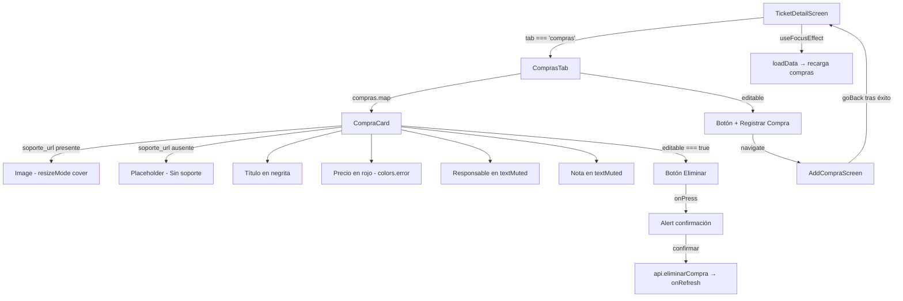

# Diseño Técnico: mobile-compras-ui

## Overview

Esta mejora reemplaza la visualización de texto plano de la pestaña "Compras" en `TicketDetailScreen.js` por tarjetas visuales ricas (`CompraCard`) que muestran la imagen del soporte, descripción en negrita, precio en rojo y responsable — logrando paridad visual con la versión web.

No se requieren cambios en el backend ni en la API. El trabajo es exclusivamente en la capa de presentación de la app móvil (React Native / Expo).

### Decisiones de diseño

- **Sin componente separado**: `CompraCard` se implementa como función interna dentro de `TicketDetailScreen.js`, igual que `FotosTab` y los demás tabs. Esto mantiene la consistencia con el patrón existente del archivo.
- **URL de imagen**: Se reutiliza el patrón ya establecido en `FotosTab` — concatenar `http://10.0.2.2:8000` con el `soporte_url` relativo.
- **Formato de precio**: Se usa `toLocaleString('es-CO')` con prefijo `$`, igual que la función `fmt` ya existente en `FinanzasTab`.
- **Fallback de imagen**: En lugar de romper el layout, se muestra un área placeholder con borde punteado y texto "Sin soporte", igual al patrón de `AddCompraScreen`.
- **`AddCompraScreen`**: Ya tiene `ActivityIndicator` y manejo de errores con `Alert.alert`. Solo se verifica que el flujo de navegación (`goBack`) sea correcto tras éxito.

---

## Architecture



El flujo de datos es unidireccional: el estado `compras` vive en `TicketDetailScreen`, se pasa como prop a `ComprasTab`, y cualquier mutación (eliminar) llama a `onRefresh` que dispara `loadData()` en el padre.

---

## Components and Interfaces

### ComprasTab (modificado)

Props sin cambios:
```js
{
  compras: CompraResponse[],
  ticketId: number,
  editable: boolean,
  navigation: NavigationProp,
  onRefresh: () => void
}
```

Responsabilidades:
- Renderizar el botón "Registrar Compra" si `editable`
- Iterar `compras` y renderizar una `CompraCard` por cada elemento
- Manejar la lógica de eliminación con diálogo de confirmación

### CompraCard (nuevo, función interna)

```js
function CompraCard({ compra, editable, onEliminar }) { ... }
```

Props:
| Prop | Tipo | Descripción |
|------|------|-------------|
| `compra` | `CompraResponse` | Objeto de compra del backend |
| `editable` | `boolean` | Muestra/oculta botón eliminar |
| `onEliminar` | `() => void` | Callback al confirmar eliminación |

Estructura visual de la tarjeta:
```
┌─────────────────────────────────┐
│  [Imagen soporte / Placeholder] │  ← height: 160, resizeMode: cover
├─────────────────────────────────┤
│  Descripción (bold)   $30.000   │  ← precio en colors.error
│  👤 Responsable                 │  ← colors.textMuted (si existe)
│  Nota...                        │  ← colors.textMuted (si existe)
│                    [✕ Eliminar] │  ← solo si editable
└─────────────────────────────────┘
```

### AddCompraScreen (sin cambios estructurales)

Ya cumple los requisitos 5.1, 5.3 y 5.4:
- Navega con `navigation.goBack()` tras éxito ✓
- Muestra `ActivityIndicator` durante la petición ✓
- Muestra `Alert.alert` en caso de error sin navegar ✓

El `useFocusEffect` en `TicketDetailScreen` garantiza la recarga automática al volver (requisito 5.2).

---

## Data Models

### CompraResponse (del backend)

```typescript
interface CompraResponse {
  id: number;
  descripcion: string;
  valor: number;          // entero, pesos colombianos
  soporte_url: string | null;  // ej: "/uploads/compras/20260311_110401_9f9a7dd6.png"
  nota: string | null;
  responsable: string | null;
}
```

### Construcción de URL de imagen

```js
// soporte_url comienza con "/uploads/" → URL relativa del servidor
const imageUri = compra.soporte_url
  ? `http://10.0.2.2:8000${compra.soporte_url}`
  : null;
```

### Formato de precio

```js
// Función de formato consistente con FinanzasTab
const fmt = (v) => v != null ? `$${v.toLocaleString('es-CO')}` : '$0';
```

Ejemplos:
| Valor (int) | Resultado |
|-------------|-----------|
| 30000 | `$30.000` |
| 0 | `$0` |
| null | `$0` |
| 1500000 | `$1.500.000` |

### Nuevos estilos requeridos en StyleSheet

```js
compraCard: {
  backgroundColor: colors.surface,
  borderRadius: 10,
  marginBottom: 12,
  borderWidth: 1,
  borderColor: colors.border,
  overflow: 'hidden',
},
compraSoporteImg: {
  width: '100%',
  height: 160,
},
compraPlaceholder: {
  height: 100,
  backgroundColor: colors.background,
  justifyContent: 'center',
  alignItems: 'center',
  borderBottomWidth: 1,
  borderBottomColor: colors.border,
},
compraPlaceholderText: {
  color: colors.textMuted,
  fontSize: 13,
},
compraBody: {
  padding: 12,
},
compraTitleRow: {
  flexDirection: 'row',
  justifyContent: 'space-between',
  alignItems: 'flex-start',
  marginBottom: 4,
},
compraTitulo: {
  fontSize: 14,
  fontWeight: '700',
  color: colors.text,
  flex: 1,
  marginRight: 8,
},
compraPrecio: {
  fontSize: 15,
  fontWeight: '700',
  color: colors.error,  // #dc2626
},
compraResponsable: {
  fontSize: 12,
  color: colors.textMuted,
  marginTop: 2,
},
compraNota: {
  fontSize: 13,
  color: colors.textMuted,
  marginTop: 4,
},
compraFooter: {
  flexDirection: 'row',
  justifyContent: 'flex-end',
  marginTop: 8,
},
```

---

## Correctness Properties

*A property is a characteristic or behavior that should hold true across all valid executions of a system — essentially, a formal statement about what the system should do. Properties serve as the bridge between human-readable specifications and machine-verifiable correctness guarantees.*

### Property 1: Formato de precio colombiano

*Para cualquier* valor entero no negativo de una compra, la función de formato debe producir una cadena que comience con `$` y cuyo cuerpo numérico use puntos como separadores de miles en notación colombiana.

**Validates: Requirements 2.1, 2.2, 2.3**

---

### Property 2: Valor cero o nulo muestra $0

*Para cualquier* compra cuyo `valor` sea `0` o `null`, la función de formato debe retornar exactamente `$0` y no una cadena vacía ni un campo ausente.

**Validates: Requirements 2.2**

---

### Property 3: URL de imagen construida correctamente

*Para cualquier* compra cuyo `soporte_url` comience con `/uploads/`, la URL de imagen construida debe ser igual a `http://10.0.2.2:8000` concatenado con `soporte_url`.

**Validates: Requirements 3.1**

---

### Property 4: Compra sin soporte_url muestra placeholder

*Para cualquier* compra con `soporte_url` igual a `null` o `undefined`, el componente `CompraCard` no debe renderizar un elemento `Image` sino el área de placeholder con texto "Sin soporte".

**Validates: Requirements 1.2, 3.2**

---

### Property 5: Eliminación refresca la lista

*Para cualquier* lista de compras con al menos un elemento, al confirmar la eliminación de una compra, la función `onRefresh` debe ser invocada exactamente una vez y la compra eliminada no debe aparecer en la lista resultante.

**Validates: Requirements 4.3**

---

## Error Handling

| Escenario | Comportamiento |
|-----------|---------------|
| Imagen de soporte no carga (`onError` en `<Image>`) | Mostrar placeholder "Sin soporte" sin interrumpir el resto de la lista |
| `api.eliminarCompra` falla | `Alert.alert('Error', e.message)` — la lista no se modifica |
| `api.getCompras` falla en `loadData` | `Alert.alert('Error', e.message)` — ya manejado por el padre `TicketDetailScreen` |
| Servidor retorna error al guardar compra en `AddCompraScreen` | `Alert.alert` con el mensaje del servidor, sin `navigation.goBack()` |

Para el manejo del error de carga de imagen, se usa la prop `onError` de `<Image>` de React Native para cambiar a un estado local `imgError` que muestra el placeholder:

```js
const [imgError, setImgError] = useState(false);
// ...
{imageUri && !imgError ? (
  <Image
    source={{ uri: imageUri }}
    style={styles.compraSoporteImg}
    resizeMode="cover"
    onError={() => setImgError(true)}
  />
) : (
  <View style={styles.compraPlaceholder}>
    <Text style={styles.compraPlaceholderText}>Sin soporte</Text>
  </View>
)}
```

---

## Testing Strategy

### Enfoque dual: Unit tests + Property-based tests

**Unit tests** (Jest + React Native Testing Library):
- Verificar que `CompraCard` renderiza la imagen cuando `soporte_url` está presente
- Verificar que `CompraCard` renderiza el placeholder cuando `soporte_url` es `null`
- Verificar que el botón "Eliminar" aparece solo cuando `editable === true`
- Verificar que el diálogo de confirmación se muestra antes de llamar a `onEliminar`
- Verificar que `AddCompraScreen` llama a `navigation.goBack()` tras éxito

**Property-based tests** (fast-check):
- Cada propiedad del diseño se implementa como un test con mínimo 100 iteraciones
- Los generadores producen objetos `CompraResponse` con valores aleatorios

**Configuración de property tests:**

```js
// Ejemplo de estructura para cada property test
import fc from 'fast-check';

// Feature: mobile-compras-ui, Property 1: Formato de precio colombiano
test('formatPrice produce formato colombiano para cualquier entero no negativo', () => {
  fc.assert(
    fc.property(fc.integer({ min: 0, max: 100_000_000 }), (valor) => {
      const result = formatPrice(valor);
      expect(result).toMatch(/^\$/);
      // el número formateado debe coincidir con toLocaleString
      expect(result).toBe(`$${valor.toLocaleString('es-CO')}`);
    }),
    { numRuns: 100 }
  );
});
```

**Tag format para cada test:**
`// Feature: mobile-compras-ui, Property {N}: {texto de la propiedad}`

**Librería recomendada:** `fast-check` (ya compatible con Jest/Expo, instalación: `npm install --save-dev fast-check`)
