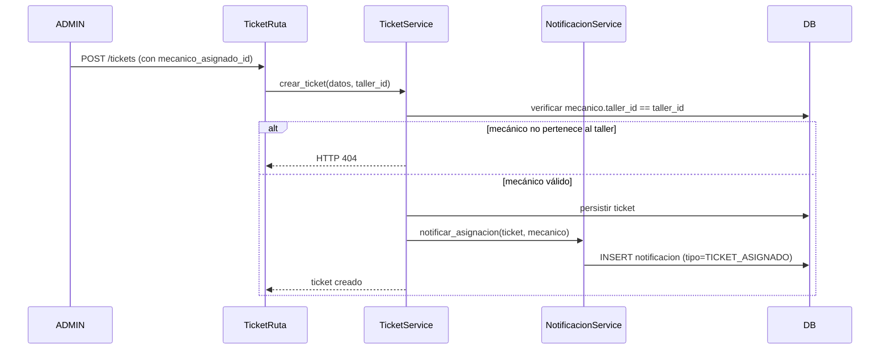
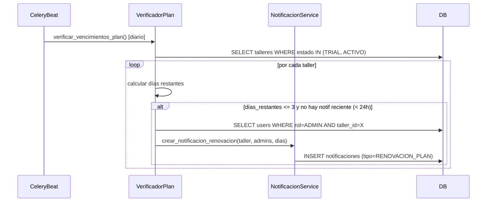

# Diseño: Sistema de Notificaciones Internas

## Visión General

El sistema de notificaciones internas provee una infraestructura de avisos persistentes en base de datos para dos casos de uso: (1) notificar a un mecánico cuando se le asigna un ticket, y (2) alertar al ADMIN cuando el plan SaaS está próximo a vencer. Ambos casos comparten el mismo modelo `Notificacion`, los mismos endpoints REST y el mismo componente de badge en la UI.

El diseño sigue estrictamente la arquitectura existente: rutas → servicios → repositorios, con aislamiento multi-tenant por `taller_id` en cada capa. Toda operación obtiene el `taller_id` exclusivamente del JWT, nunca del body ni de query params.

---

## Arquitectura

```mermaid
graph TD
    subgraph Frontend React
        NB[NotificationBadge]
        NBanner[NotificationBanner]
        Poller[Polling 30s]
    end

    subgraph Backend FastAPI
        NR[notificacion_ruta.py]
        NS[NotificacionService]
        NRepo[NotificacionRepository]
        TS[TicketService extendido]
        VP[VerificadorPlan - Celery Beat]
    end

    subgraph Base de Datos
        TN[(tabla notificaciones)]
        TT[(tabla tickets + mecanico_asignado_id)]
    end

    Poller -->|GET /notificaciones/no-leidas| NR
    NB -->|PATCH /notificaciones/{id}/leer| NR
    NBanner -->|PATCH /notificaciones/leer-todas| NR
    NR --> NS
    NS --> NRepo
    NRepo --> TN
    TS -->|asignar mecánico| NS
    VP -->|verificar vencimientos| NS
    NS --> TN
    TS --> TT
```

### Flujo de asignación de ticket



### Flujo del verificador de plan (Celery Beat)



---

## Componentes e Interfaces

### Backend

#### `app/modelos/notificacion.py`

Modelo SQLAlchemy con enum `TipoNotificacion`.

#### `app/repositorios/notificacion_repository.py`

Extiende `TenantRepository`. Métodos:
- `get_no_leidas(user_id) → list[Notificacion]`
- `get_by_id_y_usuario(notif_id, user_id) → Notificacion | None`
- `marcar_leida(notif_id, user_id) → bool`
- `marcar_todas_leidas(user_id) → int` (retorna cantidad actualizada)
- `existe_notif_renovacion_reciente(taller_id, horas=24) → bool`

#### `app/servicios/notificacion_service.py`

Lógica de negocio. Métodos:
- `obtener_no_leidas(user_id) → dict` (lista + conteo)
- `marcar_como_leida(notif_id, user_id) → Notificacion`
- `marcar_todas_como_leidas(user_id) → int`
- `crear_notificacion_asignacion(ticket, mecanico_user_id) → Notificacion | None`
- `crear_notificaciones_renovacion(taller, admins, dias_restantes) → list[Notificacion]`

#### `app/servicios/ticket_service.py` (extensión)

Se agrega el método `asignar_mecanico(ticket, mecanico_asignado_id)` que:
1. Verifica que el mecánico pertenezca al `taller_id` del servicio.
2. Detecta si el `mecanico_asignado_id` cambió respecto al valor anterior.
3. Llama a `NotificacionService.crear_notificacion_asignacion` solo si cambió.

#### `app/rutas/notificacion_ruta.py`

```
GET    /notificaciones/no-leidas          — lista + conteo de no leídas
PATCH  /notificaciones/{id}/leer          — marcar una como leída
PATCH  /notificaciones/leer-todas         — marcar todas como leídas
```

Todos los endpoints protegidos con `@require_auth` y `@require_role("ADMIN", "MECANICO")`.

#### `app/tasks/notificacion_tasks.py`

Tarea Celery Beat `verificar_vencimientos_plan` programada para ejecutarse diariamente.

### Frontend

#### `NotificationBadge`

Componente de badge en la barra de navegación. Hace polling cada 30 segundos al endpoint `GET /notificaciones/no-leidas`. Muestra el conteo si es > 0, se oculta si es 0.

#### `NotificationBanner`

Banner no bloqueante en la parte superior de la pantalla. Solo visible para usuarios con rol `ADMIN`. Se renderiza cuando existe al menos una notificación no leída de tipo `RENOVACION_PLAN`. Al cerrarlo, llama a `PATCH /notificaciones/{id}/leer`.

---

## Modelos de Datos

### Modelo `Notificacion`

```python
# app/modelos/notificacion.py
import enum
from sqlalchemy import Boolean, Column, DateTime, Enum, ForeignKey, Integer, String
from sqlalchemy.sql import func
from app.configuracion.base_datos import Base

class TipoNotificacion(enum.StrEnum):
    TICKET_ASIGNADO = "TICKET_ASIGNADO"
    RENOVACION_PLAN = "RENOVACION_PLAN"

class Notificacion(Base):
    __tablename__ = "notificaciones"

    id                   = Column(Integer, primary_key=True, index=True)
    taller_id            = Column(Integer, ForeignKey("talleres.id"), nullable=False, index=True)
    destinatario_user_id = Column(Integer, ForeignKey("users.id"), nullable=False, index=True)
    tipo                 = Column(Enum(TipoNotificacion), nullable=False, index=True)
    titulo               = Column(String(200), nullable=False)
    mensaje              = Column(String(500), nullable=False)
    leida                = Column(Boolean, default=False, nullable=False, index=True)
    fecha_creacion       = Column(DateTime(timezone=True), server_default=func.now(), nullable=False)
    referencia_id        = Column(Integer, nullable=True)  # ticket_id o taller_id según tipo
```

**Índice compuesto** para la query más frecuente (badge polling):
```sql
CREATE INDEX ix_notificaciones_tenant_user_leida
    ON notificaciones (taller_id, destinatario_user_id, leida);
```

### Extensión del modelo `Ticket`

Se agrega una columna al modelo existente:

```python
# En app/modelos/ticket.py — nueva columna
mecanico_asignado_id = Column(
    Integer, ForeignKey("mecanicos.id"), nullable=True, index=True
)
```

### Extensión del modelo `Taller`

El campo `fecha_vencimiento_plan` ya debe existir o se agrega en la migración:

```python
# En app/modelos/taller.py — nueva columna si no existe
fecha_vencimiento_plan = Column(DateTime(timezone=True), nullable=True)
```

### Schemas Pydantic

```python
# app/esquemas/notificacion_schema.py

class NotificacionRespuesta(BaseModel):
    id: int
    tipo: TipoNotificacion
    titulo: str
    mensaje: str
    leida: bool
    fecha_creacion: datetime
    referencia_id: int | None

    model_config = ConfigDict(from_attributes=True)

class NotificacionesNoLeidasRespuesta(BaseModel):
    total: int
    notificaciones: list[NotificacionRespuesta]
```

### Migración Alembic

Una sola migración con dos cambios:

```python
# migrations/versions/XXXX_add_notificaciones_y_mecanico_asignado.py

def upgrade():
    # 1. Agregar mecanico_asignado_id a tickets
    op.add_column("tickets",
        sa.Column("mecanico_asignado_id", sa.Integer(),
                  sa.ForeignKey("mecanicos.id"), nullable=True)
    )
    op.create_index("ix_tickets_mecanico_asignado_id",
                    "tickets", ["mecanico_asignado_id"])

    # 2. Agregar fecha_vencimiento_plan a talleres (si no existe)
    op.add_column("talleres",
        sa.Column("fecha_vencimiento_plan", sa.DateTime(timezone=True), nullable=True)
    )

    # 3. Crear tabla notificaciones
    op.create_table("notificaciones",
        sa.Column("id", sa.Integer(), primary_key=True),
        sa.Column("taller_id", sa.Integer(), sa.ForeignKey("talleres.id"), nullable=False),
        sa.Column("destinatario_user_id", sa.Integer(), sa.ForeignKey("users.id"), nullable=False),
        sa.Column("tipo", sa.Enum("TICKET_ASIGNADO", "RENOVACION_PLAN",
                                  name="tiponotificacion"), nullable=False),
        sa.Column("titulo", sa.String(200), nullable=False),
        sa.Column("mensaje", sa.String(500), nullable=False),
        sa.Column("leida", sa.Boolean(), default=False, nullable=False),
        sa.Column("fecha_creacion", sa.DateTime(timezone=True),
                  server_default=sa.func.now(), nullable=False),
        sa.Column("referencia_id", sa.Integer(), nullable=True),
    )
    op.create_index("ix_notificaciones_taller_id", "notificaciones", ["taller_id"])
    op.create_index("ix_notificaciones_destinatario_user_id",
                    "notificaciones", ["destinatario_user_id"])
    op.create_index("ix_notificaciones_leida", "notificaciones", ["leida"])
    op.create_index("ix_notificaciones_tenant_user_leida",
                    "notificaciones", ["taller_id", "destinatario_user_id", "leida"])

def downgrade():
    op.drop_table("notificaciones")
    op.execute("DROP TYPE IF EXISTS tiponotificacion")
    op.drop_column("talleres", "fecha_vencimiento_plan")
    op.drop_index("ix_tickets_mecanico_asignado_id", "tickets")
    op.drop_column("tickets", "mecanico_asignado_id")
```

---

## Propiedades de Corrección

*Una propiedad es una característica o comportamiento que debe sostenerse en todas las ejecuciones válidas del sistema — esencialmente, una declaración formal sobre lo que el sistema debe hacer. Las propiedades sirven como puente entre especificaciones legibles por humanos y garantías de corrección verificables por máquinas.*

### Propiedad 1: Aislamiento multi-tenant del repositorio

*Para cualquier* conjunto de notificaciones pertenecientes a múltiples talleres distintos, toda consulta al `NotificacionRepository` inicializado con un `taller_id` dado debe retornar únicamente notificaciones cuyo `taller_id` coincida exactamente con el del repositorio.

**Valida: Requisitos 1.4, 9.2**

### Propiedad 2: Invariante de tenant en notificación creada

*Para cualquier* notificación creada por el sistema, el campo `taller_id` de la notificación debe ser igual al `taller_id` del usuario `destinatario_user_id`.

**Valida: Requisitos 1.2**

### Propiedad 3: Estado inicial de notificación

*Para cualquier* notificación recién creada (independientemente del tipo, usuario o taller), el campo `leida` debe ser `false`.

**Valida: Requisitos 1.3**

### Propiedad 4: Aislamiento de asignación de mecánico

*Para cualquier* intento de asignar un `mecanico_asignado_id` a un ticket, si el mecánico pertenece a un `taller_id` diferente al del servicio, la operación debe ser rechazada con HTTP 404 y el ticket no debe ser modificado.

**Valida: Requisitos 2.2, 2.3, 2.4**

### Propiedad 5: No interferencia de campos en Ticket

*Para cualquier* ticket con `recepcionado_por` definido, asignar o cambiar `mecanico_asignado_id` no debe modificar el valor de `recepcionado_por`.

**Valida: Requisitos 2.5**

### Propiedad 6: Notificación generada al asignar mecánico

*Para cualquier* ticket al que se le asigna un `mecanico_asignado_id` válido (con `user_id` vinculado), debe existir exactamente una notificación de tipo `TICKET_ASIGNADO` dirigida al `user_id` del mecánico, con `referencia_id` igual al `id` del ticket.

**Valida: Requisitos 3.1, 3.4**

### Propiedad 7: Idempotencia de notificación de asignación

*Para cualquier* actualización de ticket donde `mecanico_asignado_id` no cambia respecto al valor anterior, el número total de notificaciones `TICKET_ASIGNADO` para ese ticket no debe aumentar.

**Valida: Requisitos 3.3**

### Propiedad 8: Aislamiento de consulta de notificaciones no leídas

*Para cualquier* usuario autenticado con `user_id` y `taller_id` dados, el endpoint `GET /notificaciones/no-leidas` debe retornar únicamente notificaciones donde `destinatario_user_id == user_id`, `taller_id == taller_id del JWT`, y `leida == false`. El campo `total` debe ser igual a `len(notificaciones)`.

**Valida: Requisitos 4.1, 4.2**

### Propiedad 9: Aislamiento de escritura al marcar como leída

*Para cualquier* intento de marcar como leída una notificación, la operación solo debe tener efecto si `notificacion.taller_id == taller_id del JWT` y `notificacion.destinatario_user_id == user_id del JWT`. Cualquier otro intento debe retornar HTTP 404 sin modificar el estado de la notificación.

**Valida: Requisitos 5.1, 5.2, 5.4**

### Propiedad 10: Leer-todas marca exactamente las notificaciones del usuario

*Para cualquier* usuario con N notificaciones no leídas, después de ejecutar `PATCH /notificaciones/leer-todas`, todas sus notificaciones deben tener `leida = true` y el conteo de no leídas debe ser 0. Las notificaciones de otros usuarios del mismo taller no deben ser afectadas.

**Valida: Requisitos 5.3**

### Propiedad 11: Verificador de plan genera notificación cuando corresponde

*Para cualquier* taller con estado `ACTIVO` o `TRIAL`, con `fecha_vencimiento_plan` definida y con diferencia de días ≤ 3 respecto a la fecha actual, el verificador debe crear notificaciones `RENOVACION_PLAN` para todos sus usuarios con rol `ADMIN`, y el `mensaje` debe contener el número exacto de días restantes.

**Valida: Requisitos 7.1, 7.6**

### Propiedad 12: Idempotencia del verificador de plan

*Para cualquier* taller para el que ya existe una notificación `RENOVACION_PLAN` creada en las últimas 24 horas, ejecutar el verificador de nuevo no debe crear notificaciones adicionales para ese taller.

**Valida: Requisitos 7.2**

### Propiedad 13: Verificador omite talleres suspendidos o cancelados

*Para cualquier* taller con estado `SUSPENDIDO` o `CANCELADO`, el verificador de plan no debe crear ninguna notificación, independientemente de la `fecha_vencimiento_plan`.

**Valida: Requisitos 7.4**

### Propiedad 14: Banner de renovación visible solo para ADMIN

*Para cualquier* lista de notificaciones que contenga al menos una `RENOVACION_PLAN` no leída, el componente `NotificationBanner` debe renderizarse cuando el usuario tiene rol `ADMIN` y no debe renderizarse cuando el usuario tiene rol `MECANICO`.

**Valida: Requisitos 8.1, 8.3, 8.4**

### Propiedad 15: Badge refleja conteo correcto

*Para cualquier* conteo de notificaciones no leídas N, el componente `NotificationBadge` debe mostrar el número N cuando N > 0 y no debe renderizarse cuando N = 0.

**Valida: Requisitos 6.1, 6.2**

---

## Manejo de Errores

| Situación | Comportamiento |
|---|---|
| `mecanico_asignado_id` no pertenece al taller del JWT | HTTP 404 — no revelar existencia del mecánico en otro taller |
| Notificación solicitada no pertenece al usuario/taller del JWT | HTTP 404 — no revelar existencia del recurso |
| JWT sin `user_id` válido | HTTP 401 |
| JWT sin `taller_id` (SUPER_ADMIN) | HTTP 403 — endpoints de notificaciones no accesibles para SUPER_ADMIN |
| Mecánico asignado sin `user_id` vinculado | Log de advertencia, omitir notificación sin lanzar error |
| Taller sin `fecha_vencimiento_plan` | Verificador omite el taller sin error |
| Error en tarea Celery de verificación | Log de error, reintento automático según política de Celery |
| Fallo de BD durante creación de notificación | Rollback de la transacción completa (ticket + notificación son atómicos) |

### Atomicidad ticket + notificación

La creación del ticket y la notificación de asignación deben ocurrir dentro de la misma transacción de base de datos. Si la notificación falla, el ticket no se persiste. Esto garantiza consistencia: nunca habrá un ticket asignado sin su notificación correspondiente.

```python
# En TicketService.crear_ticket():
with db.begin_nested():  # savepoint
    ticket = repository.create(ticket_obj)
    if mecanico_asignado_id:
        notificacion_service.crear_notificacion_asignacion(ticket, mecanico_user_id)
# commit externo en la ruta
```

---

## Estrategia de Testing

### Enfoque dual

Se usa **Hypothesis** (librería de property-based testing para Python) para las propiedades universales, complementado con tests de ejemplo para casos específicos.

Cada test de propiedad se configura con mínimo 100 iteraciones (`@settings(max_examples=100)`).

### Tests de propiedades (Hypothesis)

Cada propiedad del diseño se implementa como un test de Hypothesis:

```python
# Tag format: Feature: notificaciones-internas-sistema, Property N: <texto>

@given(st.lists(notificacion_strategy(), min_size=1))
@settings(max_examples=100)
def test_aislamiento_repositorio(notificaciones):
    # Feature: notificaciones-internas-sistema, Property 1: aislamiento multi-tenant del repositorio
    ...
```

Estrategias de generación necesarias:
- `notificacion_strategy()` — genera `Notificacion` con campos aleatorios válidos
- `taller_strategy()` — genera `Taller` con estado y fecha_vencimiento_plan aleatorios
- `user_strategy(rol)` — genera `User` con rol específico
- `ticket_con_mecanico_strategy()` — genera `Ticket` con `mecanico_asignado_id` aleatorio

### Tests de ejemplo (pytest)

- Creación de notificación con todos los campos requeridos (Req 1.1)
- Mecánico sin `user_id` vinculado no genera error (Req 3.5)
- Taller sin `fecha_vencimiento_plan` no genera error en verificador (Req 7.5)
- Endpoint sin JWT retorna 401 (Req 4.5, 9.1)
- Audit log registra creación de `RENOVACION_PLAN` (Req 9.5)
- Badge se actualiza tras marcar notificación como leída (Req 6.3)
- Banner se cierra al marcar notificación como leída (Req 8.2)
- Vista de mecánico muestra tickets asignados pendientes (Req 6.5)

### Tests de integración

- Flujo completo: crear ticket con mecánico → verificar notificación en BD
- Flujo completo: ejecutar verificador → verificar notificaciones RENOVACION_PLAN en BD
- Polling del frontend: verificar que el endpoint responde en < 300ms con índice compuesto

### Cobertura objetivo

- Todas las propiedades del diseño cubiertas por al menos un test de Hypothesis
- Todos los endpoints cubiertos por al menos un test de ejemplo
- Casos de borde de seguridad (cross-tenant) cubiertos por propiedades 1, 4, 8, 9
