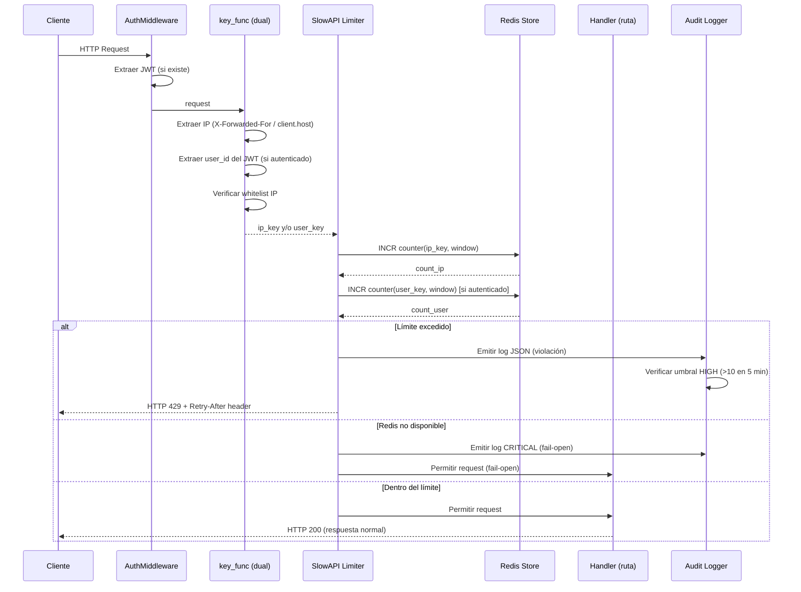
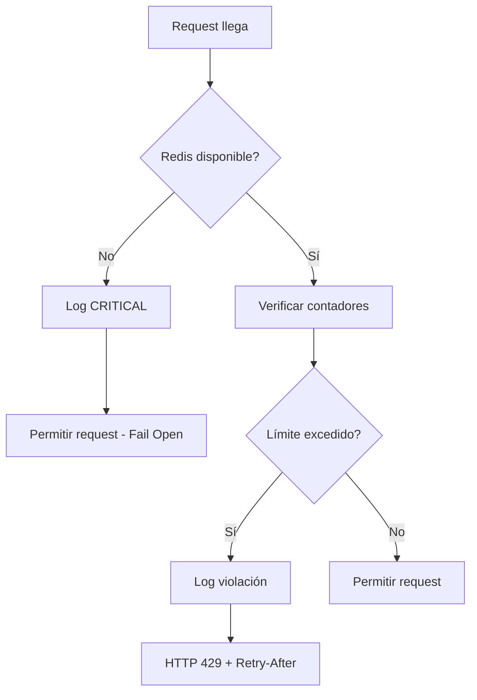

# Design Document: Rate Limiting Global

## Overview

Este documento describe el diseño técnico para implementar rate limiting robusto y completo en el SaaS multi-tenant de gestión de talleres mecánicos.

**Problema actual:** SlowAPI está instalado pero usa `storage_uri="memory://"`, lo que significa que los contadores se pierden al reiniciar el servidor y no hay cobertura en ~80% de los endpoints críticos. Tampoco existe rate limiting por usuario autenticado.

**Solución:** Migrar el storage a Redis (ya disponible en `redis:6379`), agregar una `key_func` dual (IP + usuario JWT), aplicar `default_limits` global en `app.state.limiter`, cubrir los endpoints faltantes con decoradores `@limiter.limit`, y crear un módulo de configuración declarativa con parser/pretty-printer para gestionar límites sin tocar código.

**Alcance de cambios:**
- `app/configuracion/limiter.py` — storage Redis, key_func dual
- `app/main.py` — `default_limits` global
- `app/rutas/upload_ruta.py`, `whatsapp_ruta.py`, `ticket_ruta.py`, `vehiculo_ruta.py` — decoradores `@limiter.limit`
- `app/configuracion/rate_limits_config.py` — nuevo módulo de configuración declarativa
- `.env.example` — nuevas variables `RATE_LIMIT_*`
- `requirements.txt` — agregar `slowapi[redis]`

---

## Architecture

### Flujo de un Request con Rate Limiting



### Estrategia de Claves en Redis

Cada contador en Redis sigue el patrón:

```
SLOWAPI:{key_type}:{identifier}:{endpoint_hash}:{window}
```

Ejemplos:
- `SLOWAPI:ip:192.168.1.1:global:minute` — contador global por IP, ventana minuto
- `SLOWAPI:user:42:global:minute` — contador global por usuario, ventana minuto
- `SLOWAPI:ip:192.168.1.1:/upload/foto:minute` — contador específico de endpoint

SlowAPI gestiona estas claves automáticamente cuando se configura con Redis como backend. El TTL de cada clave es igual a la duración de la ventana (60s para minuto, 3600s para hora, 86400s para día).

### Comportamiento Fail-Open

Cuando Redis no está disponible, el limiter **permite** todos los requests (fail-open) en lugar de bloquearlos. Esto es intencional: un taller no puede quedar sin acceso a su sistema por un problema de infraestructura. El error se registra como `CRITICAL` en el Audit Logger para alertar al operador.



---

## Components and Interfaces

### 1. `app/configuracion/limiter.py` (modificado)

Responsabilidad: Configurar la instancia global de SlowAPI con Redis como backend y key_func dual.

```python
# Interfaz pública
limiter: Limiter  # instancia global, importada en main.py y rutas

def _key_func(request: Request) -> str:
    """
    Retorna la clave de rate limiting para el request.
    
    Prioridad:
    1. Si es OPTIONS → "options-exempt" (sin límite)
    2. Si la IP está en whitelist → "whitelist-exempt" (sin límite)
    3. Si hay JWT válido → "user:{user_id}" (límite por usuario)
    4. Fallback → IP del cliente (límite por IP)
    
    Nota: SlowAPI aplica el límite global usando esta clave.
    Los límites por endpoint usan la misma clave base.
    """

def _get_redis_url() -> str:
    """Lee REDIS_URL del entorno. Default: redis://redis:6379."""

def _get_whitelist_ips() -> frozenset[str]:
    """Lee RATE_LIMIT_WHITELIST_IPS del entorno. Cacheado en memoria."""
```

**Cambio clave:** `storage_uri="memory://"` → `storage_uri=_get_redis_url()`.

**Límites globales** configurados en `Limiter(default_limits=[...])`:
- `"100/minute"` por IP
- `"1000/hour"` por IP
- `"5000/day"` por IP

Para usuarios autenticados, se registra un segundo limiter o se usa `@limiter.limit` con key_func específica en los endpoints que requieren límite por usuario.

### 2. `app/configuracion/rate_limits_config.py` (nuevo)

Responsabilidad: Parser y pretty-printer para configuración declarativa de rate limits en YAML/JSON.

```python
@dataclass
class EndpointRateLimit:
    pattern: str        # regex del endpoint, ej: r"^/upload/.*"
    limit: int          # número de requests
    window: str         # "minute" | "hour" | "day"
    description: str = ""

@dataclass  
class RateLimitConfig:
    version: str
    global_limits: list[GlobalLimit]
    endpoint_limits: list[EndpointRateLimit]

class RateLimitsParser:
    def parse(self, content: str, fmt: Literal["yaml", "json"]) -> RateLimitConfig:
        """
        Parsea contenido YAML o JSON en un RateLimitConfig.
        
        Raises:
            RateLimitConfigError: con mensaje descriptivo y número de línea
                                  del primer campo inválido.
        """
    
    def _validate(self, raw: dict) -> None:
        """
        Valida:
        - Todos los valores de límite son enteros > 0
        - Todos los patrones de endpoint son regex válidos
        """

class RateLimitsPrettyPrinter:
    def to_yaml(self, config: RateLimitConfig) -> str:
        """Serializa RateLimitConfig a YAML válido."""
    
    def to_json(self, config: RateLimitConfig) -> str:
        """Serializa RateLimitConfig a JSON válido con indentación."""

class RateLimitConfigError(Exception):
    def __init__(self, message: str, line_number: int | None = None):
        self.line_number = line_number
        super().__init__(message)
```

### 3. `app/main.py` (modificado)

Cambio: Agregar `default_limits` al registrar el limiter en `app.state`.

```python
# Antes
app.state.limiter = limiter

# Después — sin cambio en esta línea, los default_limits van en limiter.py
# El limiter ya se inicializa con default_limits en su constructor
app.state.limiter = limiter
app.add_exception_handler(RateLimitExceeded, _rate_limit_exceeded_handler)
```

El handler existente `_rate_limit_exceeded_handler` de SlowAPI ya retorna HTTP 429 con `Retry-After`. Se reemplazará con un handler personalizado que también emita el log de auditoría.

### 4. Rutas afectadas

Cada ruta recibe decoradores `@limiter.limit` con los valores del Requirement 2:

| Ruta | Límite adicional | Variable de entorno |
|------|-----------------|---------------------|
| `POST /upload/*` | `10/minute` | `RATE_LIMIT_UPLOAD_PER_MINUTE` |
| `POST /whatsapp/*` | `5/minute` | `RATE_LIMIT_WHATSAPP_PER_MINUTE` |
| `GET/POST /tickets*` | `30/minute` | `RATE_LIMIT_TICKETS_PER_MINUTE` |
| `GET/POST /vehiculos*` | `30/minute` | `RATE_LIMIT_VEHICULOS_PER_MINUTE` |

Los límites globales (100/min, 1000/hr, 5000/day) se aplican automáticamente a **todos** los endpoints vía `default_limits` en el constructor del `Limiter`.

### 5. Audit Logger para Rate Limiting

Responsabilidad: Emitir logs estructurados JSON para violaciones de rate limiting.

```python
# app/utils/rate_limit_logger.py (nuevo)

def log_rate_limit_violation(
    *,
    ip: str,
    endpoint: str,
    limit_type: str,          # "ip" | "user"
    limit_value: int,
    window: str,
    user_agent: str,
    timestamp: str,
    user_id: int | None = None,
    taller_id: int | None = None,
) -> None:
    """Emite log JSON estructurado de violación de rate limit."""

def log_redis_unavailable(error: Exception) -> None:
    """Emite log CRITICAL cuando Redis no está disponible."""

def check_and_alert_high_severity(ip: str, redis_client) -> None:
    """
    Verifica si una IP acumuló >10 violaciones en 5 minutos.
    Si es así, emite log con severity: HIGH.
    Usa un contador separado en Redis con TTL de 5 minutos.
    """
```

---

## Data Models

### Estructura de Claves Redis

```
# Contadores de rate limiting (gestionados por SlowAPI)
SLOWAPI:{identifier}:{limit_string}
  TTL: duración de la ventana (60s / 3600s / 86400s)
  Tipo: string (contador entero)

# Contadores de violaciones para alertas HIGH (gestionados por rate_limit_logger)
RL_VIOLATIONS:{ip}:5min
  TTL: 300 segundos (5 minutos)
  Tipo: string (contador entero)
```

### Formato de Log de Violación por IP

```json
{
  "event": "rate_limit_exceeded",
  "severity": "WARNING",
  "ip": "203.0.113.42",
  "endpoint": "/upload/foto",
  "limit_type": "ip",
  "limit_value": 10,
  "window": "minute",
  "user_agent": "Mozilla/5.0 ...",
  "timestamp": "2026-04-06T10:30:00.123456Z"
}
```

### Formato de Log de Violación por Usuario

```json
{
  "event": "rate_limit_exceeded",
  "severity": "WARNING",
  "user_id": 42,
  "taller_id": 7,
  "endpoint": "/tickets",
  "limit_type": "user",
  "limit_value": 200,
  "window": "minute",
  "user_agent": "TallerApp/2.0",
  "timestamp": "2026-04-06T10:30:00.123456Z"
}
```

### Formato de Alerta HIGH

```json
{
  "event": "rate_limit_high_severity_alert",
  "severity": "HIGH",
  "ip": "203.0.113.42",
  "violation_count": 15,
  "window_minutes": 5,
  "timestamp": "2026-04-06T10:35:00.123456Z"
}
```

### Formato de Log CRITICAL (Redis no disponible)

```json
{
  "event": "rate_limiter_redis_unavailable",
  "severity": "CRITICAL",
  "error": "Connection refused to redis:6379",
  "action": "fail_open",
  "timestamp": "2026-04-06T10:30:00.123456Z"
}
```

### Esquema de Configuración Declarativa (YAML)

```yaml
version: "1.0"
global_limits:
  - limit: 100
    window: minute
    description: "Límite global por IP"
  - limit: 1000
    window: hour
    description: "Límite global por IP por hora"
  - limit: 5000
    window: day
    description: "Límite global por IP por día"
endpoint_limits:
  - pattern: "^/upload/.*"
    limit: 10
    window: minute
    description: "Endpoints de subida de archivos"
  - pattern: "^/whatsapp/.*"
    limit: 5
    window: minute
    description: "Endpoints de WhatsApp"
  - pattern: "^/tickets.*"
    limit: 30
    window: minute
    description: "Endpoints de tickets"
  - pattern: "^/vehiculos.*"
    limit: 30
    window: minute
    description: "Endpoints de vehículos"
```

---

## Correctness Properties

*Una propiedad es una característica o comportamiento que debe ser verdadero en todas las ejecuciones válidas del sistema — esencialmente, una declaración formal sobre lo que el sistema debe hacer. Las propiedades sirven como puente entre especificaciones legibles por humanos y garantías de corrección verificables por máquina.*

### Property 1: Enforcement del límite global por IP

*Para cualquier* dirección IP y cualquier número de requests N > 100 enviados dentro de una ventana de un minuto, exactamente los primeros 100 requests deben ser permitidos y todos los requests desde el 101 en adelante deben ser rechazados con HTTP 429.

**Validates: Requirements 1.1, 1.5**

### Property 2: Respuesta 429 incluye Retry-After

*Para cualquier* IP que exceda cualquier límite configurado, la respuesta HTTP 429 debe incluir un header `Retry-After` con un valor entero positivo que represente los segundos hasta el reset de la ventana.

**Validates: Requirements 1.5**

### Property 3: Whitelist excluye de todos los límites

*Para cualquier* dirección IP presente en `RATE_LIMIT_WHITELIST_IPS` y cualquier número de requests N (sin importar cuán grande sea), todos los requests deben ser permitidos sin importar los límites configurados.

**Validates: Requirements 1.8**

### Property 4: Enforcement de límites por endpoint crítico

*Para cualquier* dirección IP y cualquier endpoint crítico con límite explícito (upload: 10/min, whatsapp: 5/min, tickets: 30/min, vehiculos: 30/min), exactamente los primeros L requests (donde L es el límite del endpoint) deben ser permitidos y todos los siguientes deben ser rechazados con HTTP 429.

**Validates: Requirements 2.1, 2.2, 2.3, 2.4**

### Property 5: El límite más restrictivo prevalece

*Para cualquier* request al que apliquen múltiples límites (global + endpoint-específico), el número máximo de requests permitidos antes de recibir HTTP 429 debe ser igual al mínimo de todos los límites aplicables.

**Validates: Requirements 2.6, 2.7**

### Property 6: Extracción correcta del user_id como clave

*Para cualquier* JWT válido que contenga un `user_id`, la función `key_func` debe retornar una clave que incluya ese `user_id`, de forma que dos requests con el mismo `user_id` pero diferente IP compartan el mismo contador de usuario.

**Validates: Requirements 3.1**

### Property 7: Independencia de contadores IP y usuario

*Para cualquier* combinación de IP y usuario autenticado, los contadores de rate limiting en Redis deben ser independientes: incrementar el contador de IP no debe afectar el contador de usuario y viceversa.

**Validates: Requirements 3.4, 3.5, 3.6**

### Property 8: Estructura completa del log de violación

*Para cualquier* evento de violación de rate limiting (por IP o por usuario), el log emitido debe ser JSON válido y debe contener todos los campos requeridos: para violaciones por IP (`ip`, `endpoint`, `limit_type`, `limit_value`, `window`, `user_agent`, `timestamp`); para violaciones por usuario (`user_id`, `taller_id`, `endpoint`, `limit_type`, `limit_value`, `window`, `user_agent`, `timestamp`).

**Validates: Requirements 4.1, 4.2, 4.6**

### Property 9: Alerta HIGH por umbral de violaciones

*Para cualquier* IP que acumule más de 10 violaciones de rate limiting dentro de una ventana de 5 minutos, el sistema debe emitir exactamente un log de alerta con `severity: "HIGH"` y el conteo correcto de violaciones acumuladas.

**Validates: Requirements 4.3, 4.4**

### Property 10: Round-trip de configuración declarativa

*Para cualquier* objeto `RateLimitConfig` válido, serializar con `RateLimitsPrettyPrinter` y luego parsear con `RateLimitsParser` debe producir un objeto equivalente al original, donde equivalencia significa patrones de endpoint idénticos y valores de límite idénticos.

**Validates: Requirements 5.1, 5.3, 5.4**

### Property 11: Rechazo de valores de límite inválidos

*Para cualquier* archivo de configuración que contenga al menos un valor de límite que sea cero, negativo, o no entero, `RateLimitsParser` debe rechazarlo con un error descriptivo que identifique el campo inválido y su valor.

**Validates: Requirements 5.5, 5.7**

### Property 12: Rechazo de patrones regex inválidos

*Para cualquier* archivo de configuración que contenga al menos un patrón de endpoint que no sea una expresión regular válida, `RateLimitsParser` debe rechazarlo con un error descriptivo que identifique el patrón inválido.

**Validates: Requirements 5.6, 5.8**

---

## Error Handling

### Redis no disponible (Fail-Open)

SlowAPI lanza una excepción interna cuando no puede conectar a Redis. Se captura en el handler de `RateLimitExceeded` y en un middleware de fallback:

```python
# En app/configuracion/limiter.py
def _create_limiter() -> Limiter:
    try:
        return Limiter(
            key_func=_key_func,
            storage_uri=_get_redis_url(),
            default_limits=["100/minute", "1000/hour", "5000/day"],
        )
    except Exception as e:
        log_redis_unavailable(e)
        # Fallback a memory:// para no bloquear el arranque
        return Limiter(key_func=_key_func, storage_uri="memory://")
```

En runtime, si Redis cae después del arranque, SlowAPI lanzará excepciones en cada check. El handler personalizado de `RateLimitExceeded` distingue entre "límite excedido" y "error de storage" para aplicar fail-open correctamente.

### Formato de error HTTP 429

El handler personalizado reemplaza el default de SlowAPI para incluir el log de auditoría:

```python
@app.exception_handler(RateLimitExceeded)
async def custom_rate_limit_handler(request: Request, exc: RateLimitExceeded):
    # 1. Emitir log de auditoría
    log_rate_limit_violation(...)
    # 2. Verificar umbral HIGH
    check_and_alert_high_severity(ip, redis_client)
    # 3. Retornar 429 con Retry-After
    retry_after = exc.retry_after or 60
    return JSONResponse(
        status_code=429,
        content={
            "error": "rate_limit_exceeded",
            "message": "Demasiadas solicitudes. Intente nuevamente más tarde.",
            "retry_after": retry_after,
        },
        headers={"Retry-After": str(retry_after)},
    )
```

### Configuración inválida al parsear

`RateLimitConfigError` incluye el número de línea del primer campo inválido para facilitar la corrección:

```python
raise RateLimitConfigError(
    f"Valor de límite inválido en línea {line_number}: "
    f"'{field_name}' = {value!r} (debe ser entero > 0)",
    line_number=line_number,
)
```

---

## Testing Strategy

### Enfoque dual: tests unitarios + property-based testing

Se usa **Hypothesis** (ya presente en el proyecto, evidenciado por `.hypothesis/`) como librería de property-based testing. Cada propiedad del diseño se implementa como un test de Hypothesis con mínimo 100 iteraciones.

### Tests unitarios (pytest)

Cubren casos específicos, integraciones y condiciones de error:

- **`tests/test_limiter_config.py`**: Verificar que el limiter se inicializa con Redis URL correcta (smoke test).
- **`tests/test_rate_limit_fail_open.py`**: Mock de Redis caído → request permitido + log CRITICAL emitido.
- **`tests/test_rate_limit_options.py`**: Requests OPTIONS no son limitados.
- **`tests/test_rate_limit_unauthenticated.py`**: Requests sin JWT solo usan contador IP.
- **`tests/test_rate_limits_config_examples.py`**: Ejemplos concretos de parsing válido e inválido.

### Tests de propiedades (Hypothesis)

Cada test de propiedad referencia su propiedad del diseño con el tag:
`# Feature: rate-limiting-global, Property N: <texto>`

```python
# tests/test_rate_limiting_properties.py

from hypothesis import given, settings
from hypothesis import strategies as st

# Feature: rate-limiting-global, Property 1: Enforcement del límite global por IP
@given(
    ip=st.ip_addresses(v=4).map(str),
    extra_requests=st.integers(min_value=1, max_value=50),
)
@settings(max_examples=100)
def test_global_ip_limit_enforcement(ip, extra_requests):
    """Para cualquier IP, exactamente 100 requests pasan y el 101+ recibe 429."""
    ...

# Feature: rate-limiting-global, Property 2: Respuesta 429 incluye Retry-After
@given(ip=st.ip_addresses(v=4).map(str))
@settings(max_examples=100)
def test_429_includes_retry_after(ip):
    """Para cualquier IP que exceda el límite, la respuesta incluye Retry-After."""
    ...

# Feature: rate-limiting-global, Property 3: Whitelist excluye de todos los límites
@given(
    ip=st.ip_addresses(v=4).map(str),
    request_count=st.integers(min_value=101, max_value=500),
)
@settings(max_examples=100)
def test_whitelist_ip_never_limited(ip, request_count):
    """Para cualquier IP en whitelist, todos los requests son permitidos."""
    ...

# Feature: rate-limiting-global, Property 10: Round-trip de configuración declarativa
@given(config=st_rate_limit_config())  # estrategia personalizada
@settings(max_examples=100)
def test_config_round_trip(config):
    """parse(print(config)) == config para cualquier RateLimitConfig válido."""
    ...

# Feature: rate-limiting-global, Property 11: Rechazo de valores de límite inválidos
@given(
    invalid_limit=st.one_of(
        st.integers(max_value=0),
        st.floats(allow_nan=False),
        st.text(min_size=1),
    )
)
@settings(max_examples=100)
def test_invalid_limit_values_rejected(invalid_limit):
    """Para cualquier valor de límite inválido, el parser lo rechaza con error descriptivo."""
    ...

# Feature: rate-limiting-global, Property 12: Rechazo de patrones regex inválidos
@given(invalid_pattern=st.text(min_size=1).filter(lambda s: not _is_valid_regex(s)))
@settings(max_examples=100)
def test_invalid_regex_patterns_rejected(invalid_pattern):
    """Para cualquier patrón regex inválido, el parser lo rechaza con error descriptivo."""
    ...
```

Los tests de propiedades 4–9 (enforcement por endpoint, límite más restrictivo, independencia de contadores, logs) usan mocks de Redis (`fakeredis`) para evitar dependencias de infraestructura y mantener los tests rápidos y deterministas.

### Configuración de Hypothesis

```python
# conftest.py o settings.py de Hypothesis
from hypothesis import settings, HealthCheck

settings.register_profile("ci", max_examples=100, suppress_health_check=[HealthCheck.too_slow])
settings.register_profile("dev", max_examples=50)
settings.load_profile("ci")
```

### Dependencias de test

```
fakeredis>=2.0.0   # Mock de Redis para tests sin infraestructura real
hypothesis>=6.0.0  # Ya presente en el proyecto
pytest-asyncio     # Para tests de endpoints FastAPI async
httpx              # Cliente HTTP para TestClient de FastAPI
```
