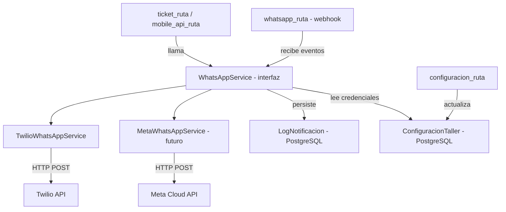

# Diseño Técnico: Integración WhatsApp Business

## Overview

Este documento describe el diseño técnico para integrar WhatsApp Business API en el sistema de taller mecánico. El objetivo es automatizar la comunicación con los clientes en los momentos clave del ciclo de vida de un ticket (recepción, finalización, entrega) y permitir el envío manual de mensajes desde el frontend web y la app móvil.

**Proveedor inicial:** Twilio (sandbox gratuito para desarrollo/pruebas), con arquitectura preparada para migrar a Meta Cloud API directamente sin cambios en la lógica de negocio.

**Decisión de diseño clave:** Se introduce `WhatsAppService` como interfaz abstracta. La implementación concreta (`TwilioWhatsAppService`) puede ser reemplazada por `MetaWhatsAppService` en el futuro cambiando únicamente la clase de implementación, no los puntos de integración en el negocio.

---

## Architecture



El flujo de notificación automática es:
1. Una ruta de negocio (ticket_ruta, mobile_api_ruta) crea/cambia estado de un ticket.
2. Llama a `whatsapp_service.enviar_notificacion(tipo, ticket, vehiculo)`.
3. El servicio lee credenciales de `ConfiguracionTaller`, construye el mensaje y llama a la API externa.
4. El resultado (éxito, error u omisión) se persiste en `log_notificacion`.

---

## Components and Interfaces

### WhatsAppService (interfaz abstracta)

`app/servicios/whatsapp_service.py`

```python
from abc import ABC, abstractmethod
from enum import Enum

class TipoEvento(str, Enum):
    RECEPCION   = "RECEPCION"
    FINALIZACION = "FINALIZACION"
    ENTREGA     = "ENTREGA"
    MANUAL      = "MANUAL"
    ENTRANTE    = "ENTRANTE"

class ResultadoEnvio(str, Enum):
    ENVIADO  = "ENVIADO"
    ERROR    = "ERROR"
    OMITIDO  = "OMITIDO"

class WhatsAppService(ABC):
    @abstractmethod
    async def enviar_notificacion(
        self,
        tipo: TipoEvento,
        ticket,          # Ticket SQLAlchemy model
        vehiculo,        # Vehiculo SQLAlchemy model
        db,              # Session
    ) -> ResultadoEnvio: ...

    @abstractmethod
    async def enviar_mensaje_manual(
        self,
        ticket_id: int,
        telefono: str,
        mensaje: str,
        db,
    ) -> dict: ...
```

### TwilioWhatsAppService (implementación concreta)

`app/servicios/twilio_whatsapp_service.py`

Implementa `WhatsAppService` usando `httpx` para llamar a la API REST de Twilio. Lee credenciales de `ConfiguracionTaller` (id=1) en cada llamada para reflejar cambios en caliente.

### whatsapp_ruta (router FastAPI)

`app/rutas/whatsapp_ruta.py`

Expone:
- `GET /whatsapp/webhook` — verificación de Meta
- `POST /whatsapp/webhook` — recepción de eventos entrantes
- `GET /api/mobile/whatsapp/logs` — consulta de log
- `POST /api/mobile/tickets/{ticket_id}/whatsapp` — envío manual desde app móvil
- `POST /api/whatsapp/tickets/{ticket_id}/mensaje` — envío manual desde frontend web

### Puntos de integración en rutas existentes

| Evento | Archivo | Punto de llamada |
|--------|---------|-----------------|
| Ticket creado (ABIERTO) | `app/rutas/ticket_ruta.py` | Después de `db.commit()` en creación |
| Ticket → FINALIZADO | `app/servicios/ticket_service.py` | Al final de `finalizar_ticket()` |
| Ticket → ENTREGADO | `app/rutas/mobile_api_ruta.py` | En `entregar_ticket_mobile()` |

Las llamadas al servicio son `fire-and-forget` con `asyncio.create_task()` para no bloquear la respuesta HTTP al cliente.

---

## Data Models

### Extensión de ConfiguracionTaller

```sql
ALTER TABLE configuracion_taller
  ADD COLUMN whatsapp_token     TEXT,
  ADD COLUMN whatsapp_phone_id  VARCHAR(50),
  ADD COLUMN whatsapp_enabled   BOOLEAN NOT NULL DEFAULT FALSE;
```

Modelo SQLAlchemy actualizado en `app/modelos/configuracion_taller.py`:

```python
whatsapp_token    = Column(Text, nullable=True)
whatsapp_phone_id = Column(String(50), nullable=True)
whatsapp_enabled  = Column(Boolean, default=False, nullable=False)
```

### Nueva tabla: log_notificacion

```sql
CREATE TABLE log_notificacion (
    id               SERIAL PRIMARY KEY,
    ticket_id        INTEGER REFERENCES tickets(id) ON DELETE SET NULL,
    telefono_destino VARCHAR(30),
    tipo_evento      VARCHAR(20) NOT NULL,  -- RECEPCION, FINALIZACION, ENTREGA, MANUAL, ENTRANTE
    mensaje_enviado  TEXT,
    resultado        VARCHAR(10) NOT NULL,  -- ENVIADO, ERROR, OMITIDO
    error_detalle    TEXT,
    created_at       TIMESTAMP WITH TIME ZONE DEFAULT NOW()
);

CREATE INDEX idx_log_notificacion_ticket_id ON log_notificacion(ticket_id);
CREATE INDEX idx_log_notificacion_created_at ON log_notificacion(created_at DESC);
```

Modelo SQLAlchemy `app/modelos/log_notificacion.py`:

```python
from sqlalchemy import Column, Integer, String, Text, DateTime, ForeignKey
from sqlalchemy.sql import func
from app.configuracion.base_datos import Base

class LogNotificacion(Base):
    __tablename__ = "log_notificacion"

    id               = Column(Integer, primary_key=True, index=True)
    ticket_id        = Column(Integer, ForeignKey("tickets.id", ondelete="SET NULL"), nullable=True, index=True)
    telefono_destino = Column(String(30), nullable=True)
    tipo_evento      = Column(String(20), nullable=False)
    mensaje_enviado  = Column(Text, nullable=True)
    resultado        = Column(String(10), nullable=False)
    error_detalle    = Column(Text, nullable=True)
    created_at       = Column(DateTime(timezone=True), server_default=func.now(), index=True)
```

### Esquemas Pydantic

```python
# Configuración WhatsApp (en configuracion_ruta)
class WhatsAppConfigUpdate(BaseModel):
    whatsapp_token: Optional[str] = None
    whatsapp_phone_id: Optional[str] = None
    whatsapp_enabled: bool = False

# Envío manual
class MensajeManualRequest(BaseModel):
    mensaje: str  # validado: 1-1024 chars

# Respuesta log
class LogNotificacionResponse(BaseModel):
    id: int
    ticket_id: Optional[int]
    telefono_destino: Optional[str]
    tipo_evento: str
    resultado: str
    error_detalle: Optional[str]
    created_at: datetime

    class Config:
        from_attributes = True
```

---

## Correctness Properties

*A property is a characteristic or behavior that should hold true across all valid executions of a system — essentially, a formal statement about what the system should do. Properties serve as the bridge between human-readable specifications and machine-verifiable correctness guarantees.*

### Property 1: Credenciales persisten y se recuperan correctamente

*For any* conjunto de credenciales WhatsApp (token, phone_id, enabled), guardarlas en ConfiguracionTaller y luego leerlas debe producir los mismos valores originales.

**Validates: Requirements 1.1**

### Property 2: Validación de phone_id rechaza no-numéricos

*For any* string `whatsapp_phone_id`, el sistema debe aceptarlo si y solo si está compuesto únicamente por dígitos (y no está vacío).

**Validates: Requirements 1.2**

### Property 3: Servicio deshabilitado produce resultado OMITIDO

*For any* ticket y vehículo válidos, si `whatsapp_enabled` es `false`, entonces llamar a `enviar_notificacion` debe retornar `OMITIDO` y no realizar ninguna llamada HTTP externa.

**Validates: Requirements 1.3, 7.4**

### Property 4: Token vacío produce log de error sin llamada HTTP

*For any* intento de envío con `whatsapp_token` vacío o nulo, el servicio debe crear un registro en `log_notificacion` con `resultado=ERROR` y no realizar ninguna llamada HTTP externa.

**Validates: Requirements 1.4**

### Property 5: Cambio de estado de ticket dispara notificación

*For any* ticket con `telefono_propietario` válido y configuración habilitada, cuando el ticket cambia a estado ABIERTO, FINALIZADO o ENTREGADO, el servicio debe intentar enviar exactamente una notificación WhatsApp para ese evento.

**Validates: Requirements 2.1, 3.1, 4.1**

### Property 6: Mensaje de notificación contiene los campos requeridos según tipo de evento

*For any* ticket y vehículo con datos válidos, el texto del mensaje generado para cada tipo de evento debe contener todos los campos obligatorios definidos para ese evento:
- RECEPCION: nombre propietario, placa, código ticket, motivo visita
- FINALIZACION: nombre propietario, placa, código ticket, total servicio, saldo pendiente
- ENTREGA: nombre propietario, placa, código ticket

**Validates: Requirements 2.2, 3.2, 4.2**

### Property 7: Teléfono ausente produce log OMITIDO con motivo "sin_telefono"

*For any* ticket cuyo vehículo tenga `telefono_propietario` vacío o nulo, llamar a `enviar_notificacion` debe crear un registro en `log_notificacion` con `resultado=OMITIDO` y `error_detalle` conteniendo "sin_telefono", sin realizar llamada HTTP.

**Validates: Requirements 2.3**

### Property 8: Error de API externa no interrumpe el flujo del ticket

*For any* ticket en proceso de creación, finalización o entrega, si la API de WhatsApp retorna un código de error HTTP, la operación sobre el ticket debe completarse exitosamente y el error debe quedar registrado en `log_notificacion`.

**Validates: Requirements 2.4, 3.4, 4.4, 5.4**

### Property 9: Validación de longitud de mensaje manual

*For any* string `mensaje`, el endpoint de envío manual debe aceptarlo si y solo si su longitud está en el rango [1, 1024] caracteres. Strings vacíos o mayores a 1024 deben ser rechazados con HTTP 422.

**Validates: Requirements 5.2, 6.3**

### Property 10: Envío manual exitoso retorna message_id

*For any* envío manual exitoso, la respuesta debe contener el campo `message_id` con el identificador devuelto por la API de WhatsApp, y el log debe registrar `resultado=ENVIADO`.

**Validates: Requirements 5.3, 6.4**

### Property 11: Log persiste todos los campos requeridos

*For any* intento de envío (automático o manual), el registro creado en `log_notificacion` debe contener valores no nulos para: `tipo_evento`, `resultado`, `created_at`. Los campos `ticket_id`, `telefono_destino` y `mensaje_enviado` deben reflejar los valores del intento.

**Validates: Requirements 5.5, 7.1**

### Property 12: Endpoint de logs retorna máximo 100 registros ordenados por fecha descendente

*For any* conjunto de registros en `log_notificacion`, el endpoint `GET /api/mobile/whatsapp/logs` debe retornar como máximo 100 registros, y deben estar ordenados por `created_at` de más reciente a más antiguo.

**Validates: Requirements 7.2**

### Property 13: Filtro por ticket_id en logs es correcto

*For any* conjunto de logs con múltiples ticket_ids, consultar con `?ticket_id=X` debe retornar únicamente registros donde `ticket_id == X`.

**Validates: Requirements 7.3**

### Property 14: Webhook registra mensajes entrantes con tipo ENTRANTE

*For any* payload de webhook con tipo `message`, el sistema debe crear un registro en `log_notificacion` con `tipo_evento=ENTRANTE` y retornar HTTP 200.

**Validates: Requirements 8.3, 8.5**

---

## Error Handling

### Estrategia general: fail-safe

Las notificaciones WhatsApp son **secundarias** al flujo de negocio. Ningún error de WhatsApp debe impedir la creación, finalización o entrega de un ticket.

| Escenario | Comportamiento |
|-----------|---------------|
| `whatsapp_enabled = false` | Retorna OMITIDO, no llama API, registra en log |
| `whatsapp_token` vacío/nulo | Registra ERROR en log, no llama API |
| `telefono_propietario` vacío/nulo | Registra OMITIDO con "sin_telefono", no llama API |
| API externa retorna 4xx/5xx | Registra ERROR con detalle HTTP, continúa flujo |
| Timeout de red | Captura excepción, registra ERROR, continúa flujo |
| Error de BD al guardar log | Log silencioso en consola, no propaga excepción |

### Manejo de errores en webhook

- Token de verificación incorrecto → HTTP 403
- Payload malformado → HTTP 200 (para evitar reintentos de Meta) + log de error
- Error interno al procesar → HTTP 200 + log de error

### Validaciones de entrada

- `whatsapp_phone_id`: solo dígitos, rechaza con HTTP 422 si no cumple
- `mensaje` manual: longitud [1, 1024], rechaza con HTTP 422 si no cumple
- `WHATSAPP_VERIFY_TOKEN`: leído de variable de entorno, no de BD

---

## Testing Strategy

### Enfoque dual: unit tests + property-based tests

Se usa **Hypothesis** (ya presente en el proyecto, ver `.hypothesis/`) como librería de property-based testing.

#### Unit Tests (pytest)

Cubren casos concretos y puntos de integración:

- Creación de ticket dispara llamada al servicio WhatsApp (mock)
- Finalización de ticket dispara llamada al servicio WhatsApp (mock)
- Entrega de ticket dispara llamada al servicio WhatsApp (mock)
- Webhook GET responde correctamente al challenge de Meta
- Webhook POST con token incorrecto retorna 403
- Endpoint de logs retorna estructura correcta
- Envío manual desde app móvil retorna `{"ok": false, ...}` con HTTP 200 en caso de fallo

#### Property-Based Tests (Hypothesis)

Cada test referencia la propiedad del diseño con el tag:
`# Feature: whatsapp-business-integration, Property N: <texto>`

Mínimo 100 iteraciones por test (`settings(max_examples=100)`).

| Test | Propiedad | Estrategia Hypothesis |
|------|-----------|----------------------|
| `test_credenciales_round_trip` | Property 1 | `st.text()` para token, `st.from_regex(r'\d+')` para phone_id |
| `test_phone_id_validacion` | Property 2 | `st.text()` — verifica que solo pasan dígitos |
| `test_servicio_deshabilitado_omite` | Property 3 | `st.builds(Ticket)`, config con enabled=False |
| `test_token_vacio_no_llama_http` | Property 4 | `st.one_of(st.none(), st.just(""))` para token |
| `test_mensaje_contiene_campos_requeridos` | Property 6 | `st.builds(Ticket)`, `st.builds(Vehiculo)` con datos aleatorios |
| `test_telefono_ausente_omitido` | Property 7 | `st.one_of(st.none(), st.just(""))` para teléfono |
| `test_longitud_mensaje_manual` | Property 9 | `st.text(min_size=0, max_size=2000)` |
| `test_log_campos_requeridos` | Property 11 | `st.builds(LogNotificacion)` con campos aleatorios |
| `test_logs_ordenados_y_limitados` | Property 12 | `st.lists(st.builds(LogNotificacion), min_size=0, max_size=200)` |
| `test_filtro_ticket_id_correcto` | Property 13 | `st.lists(...)` con múltiples ticket_ids |

#### Configuración de Hypothesis

```python
from hypothesis import settings, HealthCheck

settings.register_profile("ci", max_examples=100, suppress_health_check=[HealthCheck.too_slow])
settings.load_profile("ci")
```

#### Archivos de test

```
tests/
  test_whatsapp_service.py        # Unit + property tests del servicio
  test_whatsapp_ruta.py           # Unit tests de endpoints (webhook, logs, manual)
  test_whatsapp_configuracion.py  # Property tests de validación de credenciales
```
